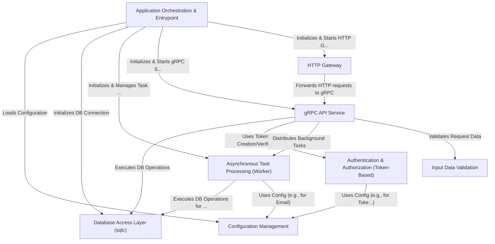

# Simplebank

This project provides a _simple banking service_ API.
It allows users to create accounts, log in, and potentially perform transactions (though only user management is fully shown in the snippets).
The core API is built using **gRPC**, and an **HTTP Gateway** translates requests for web clients.
It uses a **PostgreSQL** database (managed by `sqlc`) for storing data, **Redis** for background task queuing (_like sending verification emails_), and **Paseto/JWT** for user authentication.
Configuration is managed externally, and input data is validated before processing.

**Source Repository:** [https://github.com/spaghetti-lover/simplebank](https://github.com/spaghetti-lover/simplebank)



## Chapters

1. [gRPC API Service
   ](doc/01_grpc_api_service_.md)
2. [Database Access Layer (sqlc)
   ](doc/02_database_access_layer__sqlc__.md)
3. [Input Data Validation
   ](doc/03_input_data_validation_.md)
4. [HTTP Gateway
   ](doc/04_http_gateway_.md)
5. [Authentication & Authorization (Token-Based)
   ](doc/05_authentication___authorization__token_based__.md)
6. [Asynchronous Task Processing (Worker)
   ](doc/06_asynchronous_task_processing__worker__.md)
7. [Configuration Management
   ](doc/07_configuration_management_.md)
8. [Application Orchestration & Entrypoint
   ](doc/08_application_orchestration___entrypoint_.md)
9. [Database Design
   ](doc/09_database_design.md)

## Setup local development

### Install tools

- [Docker desktop](https://www.docker.com/products/docker-desktop)
- [TablePlus](https://tableplus.com/)
- [Golang](https://golang.org/)
- [Homebrew](https://brew.sh/)
- [Migrate](https://github.com/golang-migrate/migrate/tree/master/cmd/migrate)

  ```bash
  brew install golang-migrate
  ```

- [DB Docs](https://dbdocs.io/docs)

  ```bash
  npm install -g dbdocs
  dbdocs login
  ```

- [DBML CLI](https://www.dbml.org/cli/#installation)

  ```bash
  npm install -g @dbml/cli
  dbml2sql --version
  ```

- [Sqlc](https://github.com/kyleconroy/sqlc#installation)

  ```bash
  brew install sqlc
  ```

- [Gomock](https://github.com/golang/mock)

  ```bash
  go install github.com/golang/mock/mockgen@v1.6.0
  ```

### Setup infrastructure

- Create the bank-network

  ```bash
  make network
  ```

- Start postgres container:

  ```bash
  make postgres
  ```

- Create simple_bank database:

  ```bash
  make createdb
  ```

- Run db migration up all versions:

  ```bash
  make migrateup
  ```

- Run db migration up 1 version:

  ```bash
  make migrateup1
  ```

- Run db migration down all versions:

  ```bash
  make migratedown
  ```

- Run db migration down 1 version:

  ```bash
  make migratedown1
  ```

### Documentation

- Generate DB documentation:

  ```bash
  make db_docs
  ```

- Access the DB documentation at [this address](https://dbdocs.io/techschool.guru/simple_bank). Password: `secret`

### How to generate code

- Generate schema SQL file with DBML:

  ```bash
  make db_schema
  ```

- Generate SQL CRUD with sqlc:

  ```bash
  make sqlc
  ```

- Generate DB mock with gomock:

  ```bash
  make mock
  ```

- Create a new db migration:

  ```bash
  make new_migration name=<migration_name>
  ```

### How to run

- Run server:

  ```bash
  make server
  ```

- Run test:

  ```bash
  make test
  ```

## Deploy to kubernetes cluster

- [Install nginx ingress controller](https://kubernetes.github.io/ingress-nginx/deploy/#aws):

  ```bash
  kubectl apply -f https://raw.githubusercontent.com/kubernetes/ingress-nginx/controller-v0.48.1/deploy/static/provider/aws/deploy.yaml
  ```

- [Install cert-manager](https://cert-manager.io/docs/installation/kubernetes/):

  ```bash
  kubectl apply -f https://github.com/jetstack/cert-manager/releases/download/v1.4.0/cert-manager.yaml
  ```

---
