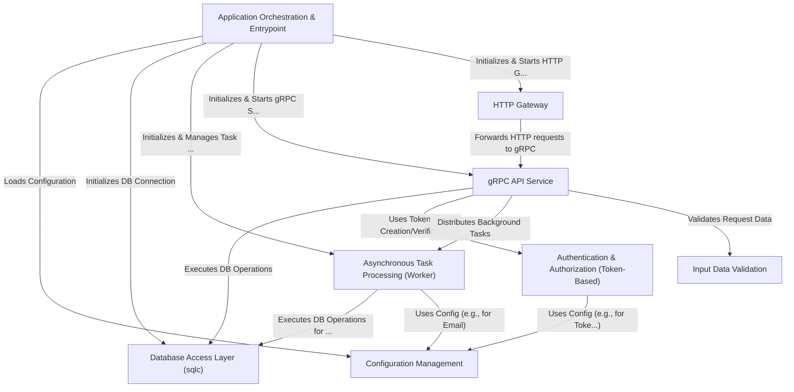

# Simplebank

This project provides a _simple banking service_ API.
It allows users to create accounts, log in, and potentially perform transactions (though only user management is fully shown in the snippets).
The core API is built using **gRPC**, and an **HTTP Gateway** translates requests for web clients.
It uses a **PostgreSQL** database (managed by `sqlc`) for storing data, **Redis** for background task queuing (_like sending verification emails_), and **Paseto/JWT** for user authentication.
Configuration is managed externally, and input data is validated before processing.

**Source Repository:** [https://github.com/spaghetti-lover/simplebank](https://github.com/spaghetti-lover/simplebank)

## Chapters

1. [gRPC API Service
   ](doc/01_grpc_api_service_.md)
2. [Database Access Layer (sqlc)
   ](doc/02_database_access_layer__sqlc__.md)
3. [Input Data Validation
   ](doc/03_input_data_validation_.md)
4. [HTTP Gateway
   ](doc/04_http_gateway_.md)
5. [Authentication & Authorization (Token-Based)
   ](doc/05_authentication___authorization__token_based__.md)
6. [Asynchronous Task Processing (Worker)
   ](doc/06_asynchronous_task_processing__worker__.md)
7. [Configuration Management
   ](doc/07_configuration_management_.md)
8. [Application Orchestration & Entrypoint
   ](doc/08_application_orchestration___entrypoint_.md)
9. [Database Design
   ](doc/09_database_design.md)

---
