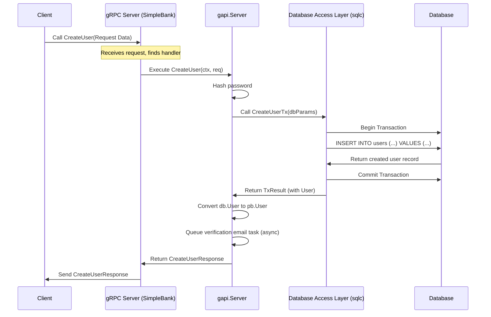

# Chapter 1: gRPC API Service

Welcome to the SimpleBank tutorial! We're excited to guide you through building a backend system for a simple, yet functional, bank.

Imagine you want to build a house. You wouldn't just start throwing bricks together, right? You'd need blueprints to define the rooms, how they connect, and what goes where. Similarly, in a software project like SimpleBank, we need a clear plan for how different parts of the system will talk to each other.

Our bank needs to perform actions like creating new users, allowing users to log in, checking balances, and transferring money. How does the part of the system handling login requests know how to talk to the part that manages user data in the database? This is where our **gRPC API Service** comes in.

Think of it as the bank's internal phone system. It defines:

1.  **Who you can call:** Which services are available (e.g., the User service, the Account service).
2.  **What you can ask for:** Which specific functions can be called (e.g., `CreateUser`, `LoginUser`).
3.  **How to ask:** What information you need to provide for each function (the _request_).
4.  **What you get back:** What information the function will return (the _response_).

This ensures that communication is structured, predictable, and efficient.

## Key Concepts: gRPC and Protocol Buffers

SimpleBank uses **gRPC** (gRPC Remote Procedure Call) as its internal communication framework.

- **gRPC:** Imagine a super-fast, efficient phone line designed specifically for computer programs to talk to each other. It's developed by Google and is known for high performance, making it great for communication _within_ our application (service-to-service).

- **Protocol Buffers (Protobuf):** If gRPC is the phone line, Protobuf is the _language_ or _contract_ spoken over that line. It's a way to define the structure of the data being sent back and forth. Think of it like a standardized form you fill out before making your gRPC call. You define what fields are required (like `username`, `password`), what type they are (text, number), and their names. This ensures both the caller and the receiver understand the data format.

### The Blueprints: `.proto` Files

We define our gRPC services and Protobuf messages in special files ending with `.proto`. These are like the architectural blueprints for our API.

For example, inside a `.proto` file, we might define:

- A `SimpleBank` service.
- Functions (RPCs) within that service, like `CreateUser` and `LoginUser`.
- The structure of the data needed for `CreateUser` (e.g., `CreateUserRequest` message with fields for `username`, `full_name`, `email`, `password`).
- The structure of the data returned by `CreateUser` (e.g., `CreateUserResponse` message containing the details of the newly created `User`).

Here's a tiny peek at how we might define the `CreateUserRequest` message in a `.proto` file (don't worry about the syntax details now):

```protobuf
// Simplified snippet from a .proto file

message CreateUserRequest {
  string username = 1;
  string full_name = 2;
  string email = 3;
  string password = 4;
}

message User {
  string username = 1;
  string full_name = 2;
  string email = 3;
  // ... other fields like creation time
}

message CreateUserResponse {
  User user = 1;
}
```

This defines the "form" for creating a user and the expected response.

### From Blueprints to Go Code: The `pb` Package

Writing `.proto` files is great for defining the structure, but our Go application can't directly use them. We need to _compile_ these `.proto` blueprints into actual Go code.

We use a tool called `protoc` (Protocol Buffer Compiler) to do this. It reads our `.proto` files and generates Go files that define corresponding Go structs and interfaces.

In SimpleBank, this generated code lives in the `pb` package. You'll see files like:

- `pb/user.pb.go`: Defines the Go struct for the `User` message.
- `pb/rpc_create_user.pb.go`: Defines Go structs for `CreateUserRequest` and `CreateUserResponse`.
- `pb/service_simple_bank.pb.go`: Contains general definitions for the service.
- `pb/service_simple_bank_grpc.pb.go`: Defines Go interfaces for the `SimpleBank` gRPC server and client.

Let's look at a small piece of the generated `pb/rpc_create_user.pb.go`:

```go
// --- File: pb/rpc_create_user.pb.go ---
// Code generated by protoc-gen-go. DO NOT EDIT.
// ... (some boilerplate)

package pb

// ... (imports)

// This struct is generated directly from the
// CreateUserRequest message in the .proto file!
type CreateUserRequest struct {
	state         protoimpl.MessageState
	sizeCache     protoimpl.SizeCache
	unknownFields protoimpl.UnknownFields

	Username string `protobuf:"bytes,1,opt,name=username,proto3" json:"username,omitempty"`
	FullName string `protobuf:"bytes,2,opt,name=full_name,json=fullName,proto3" json:"full_name,omitempty"`
	Email    string `protobuf:"bytes,3,opt,name=email,proto3" json:"email,omitempty"`
	Password string `protobuf:"bytes,4,opt,name=password,proto3" json:"password,omitempty"`
}

// ... (other generated code like methods for the struct)
```

This generated code gives us Go types we can use directly in our application when handling a "Create User" request.

And here's a snippet from `pb/service_simple_bank_grpc.pb.go` showing the server interface:

```go
// --- File: pb/service_simple_bank_grpc.pb.go ---
// Code generated by protoc-gen-go-grpc. DO NOT EDIT.
// ... (some boilerplate)

package pb

// ... (imports)

// SimpleBankServer is the server API for SimpleBank service.
// All implementations must embed UnimplementedSimpleBankServer
// for forward compatibility
type SimpleBankServer interface {
	CreateUser(context.Context, *CreateUserRequest) (*CreateUserResponse, error)
	UpdateUser(context.Context, *UpdateUserRequest) (*UpdateUserResponse, error)
	LoginUser(context.Context, *LoginUserRequest) (*LoginUserResponse, error)
	VerifyEmail(context.Context, *VerifyEmailRequest) (*VerifyEmailResponse, error)
	// This is required for technical reasons (forward compatibility)
	mustEmbedUnimplementedSimpleBankServer()
}

// ... (client interface and registration functions)
```

This interface lists the functions our actual gRPC server _must_ implement.

### The Implementation: The `gapi` Package

The `pb` package gives us the _structure_ and _interfaces_, but it doesn't contain the actual _logic_. Where does the code live that _actually_ creates a user in the database when the `CreateUser` gRPC function is called?

That logic resides in the `gapi` (gRPC API) package. This package contains the Go implementation of the `SimpleBankServer` interface defined in `pb/service_simple_bank_grpc.pb.go`.

Inside `gapi`, you'll find files like:

- `gapi/rpc_create_user.go`: Contains the `CreateUser` function implementation.
- `gapi/rpc_login_user.go`: Contains the `LoginUser` function implementation.
- `gapi/server.go`: Defines the main `Server` struct that holds everything together (like configuration and database connections).
- `gapi/converter.go`: Helper functions to convert between database types and Protobuf types.

## Use Case: Creating a New User

Let's see how these pieces work together for our "Create User" use case.

1.  **Define:** We define the `CreateUser` RPC and its request/response messages (`CreateUserRequest`, `CreateUserResponse`, `User`) in our `.proto` files.
2.  **Generate:** We run `protoc` to generate the Go structs and interfaces in the `pb` package (`pb.CreateUserRequest`, `pb.CreateUserResponse`, `pb.User`, `pb.SimpleBankServer`).
3.  **Implement:** We write the actual logic in the `gapi` package.

Here's a simplified look at the `CreateUser` implementation in `gapi/rpc_create_user.go`:

```go
// --- File: gapi/rpc_create_user.go ---
package gapi

import (
	// ... necessary imports
	db "github.com/spaghetti-lover/simplebank/db/sqlc" // Our database package
	"github.com/spaghetti-lover/simplebank/pb"         // Generated protobuf code
	"github.com/spaghetti-lover/simplebank/util"       // Utility functions (like hashing)
)

// CreateUser implements the CreateUser RPC defined in our .proto file
func (server *Server) CreateUser(ctx context.Context, req *pb.CreateUserRequest) (*pb.CreateUserResponse, error) {
	// Input validation would happen here (covered in Chapter 3)

	// Hash the user's password before saving
	hashedPassword, err := util.HashPassword(req.GetPassword())
	if err != nil {
		// Return an internal error status
		return nil, status.Errorf(codes.Internal, "failed to hash password: %s", err)
	}

	// Prepare arguments to call the database function
	// This uses types defined by our database layer (Chapter 2)
	arg := db.CreateUserTxParams{
		CreateUserParams: db.CreateUserParams{
			Username:       req.GetUsername(),
			HashedPassword: hashedPassword,
			FullName:       req.GetFullName(),
			Email:          req.GetEmail(),
		},
		// We can also define actions to run after user creation,
		// like sending a verification email (Chapter 6)
		AfterCreate: func(user db.User) error {
			// Logic to queue an email task (simplified)
			return server.queueTaskSendVerifyEmail(ctx, user) // See Chapter 6
		},
	}

	// Call the database layer (Chapter 2) to create the user in a transaction
	txResult, err := server.store.CreateUserTx(ctx, arg)
	if err != nil {
		// Handle potential database errors (e.g., username already exists)
		return nil, status.Errorf(codes.Internal, "failed to create user: %s", err)
	}

	// Convert the database user object to the Protobuf User object
	// using a helper function from gapi/converter.go
	rsp := &pb.CreateUserResponse{
		User: convertUser(txResult.User),
	}

	// Return the response
	return rsp, nil
}

// Helper function (simplified)
func (server *Server) queueTaskSendVerifyEmail(ctx context.Context, user db.User) error {
	// This would interact with our task distributor (Chapter 6)
	fmt.Printf("Queueing verification email for %s\n", user.Username)
	return nil
}
```

This function takes the `pb.CreateUserRequest` (generated from our `.proto` definition), processes the data (hashes password), interacts with the [Database Access Layer (sqlc)](02_database_access_layer__sqlc__.md) (`server.store`), potentially triggers an asynchronous task using the [Asynchronous Task Processing (Worker)](06_asynchronous_task_processing__worker__.md), converts the result back into a `pb.CreateUserResponse`, and sends it back to the caller.

## Under the Hood: How a gRPC Call Works

Let's visualize the flow when a client (another internal service, or perhaps a mobile app via a gateway later) calls the `CreateUser` function:



1.  **Client Request:** A client application uses the generated gRPC client code (`pb.NewSimpleBankClient`) to call the `CreateUser` function, sending the `pb.CreateUserRequest` data.
2.  **Server Receives:** The main SimpleBank gRPC server (running based on `gapi/server.go`) receives the incoming call.
3.  **Handler Execution:** The server routes the call to the specific implementation method in our `gapi` package - the `CreateUser` function within the `gapi.Server` struct.
4.  **Business Logic:** The `CreateUser` function in `gapi/rpc_create_user.go` executes:
    - It validates the input ([Input Data Validation](03_input_data_validation_.md)).
    - It hashes the password.
    - It calls the appropriate function in the [Database Access Layer (sqlc)](02_database_access_layer__sqlc__.md) (`server.store`) to actually insert the user data into the database.
    - It might trigger background tasks like sending emails via the [Asynchronous Task Processing (Worker)](06_asynchronous_task_processing__worker__.md).
5.  **Database Interaction:** The database layer handles the communication with the actual PostgreSQL database.
6.  **Response Preparation:** The `CreateUser` function gets the result back from the database layer, converts it into the `pb.CreateUserResponse` format using helpers like `gapi.convertUser`.
7.  **Server Responds:** The gRPC server sends the `pb.CreateUserResponse` back to the client.

The `gapi/server.go` file sets up this server structure:

```go
// --- File: gapi/server.go ---
package gapi

import (
	// ... imports
	db "github.com/spaghetti-lover/simplebank/db/sqlc"
	"github.com/spaghetti-lover/simplebank/pb"
	"github.com/spaghetti-lover/simplebank/token" // For authentication (Chapter 5)
	"github.com/spaghetti-lover/simplebank/worker" // For async tasks (Chapter 6)
	"github.com/spaghetti-lover/simplebank/util"  // For config (Chapter 7)
)

// Server serves gRPC requests for our banking service.
// It holds all the dependencies needed by the RPC handlers.
type Server struct {
	// Required interface embedding for gRPC
	pb.UnimplementedSimpleBankServer
	config          util.Config // App configuration (Chapter 7)
	store           db.Store    // Database access layer (Chapter 2)
	tokenMaker      token.Maker // Token creation/verification (Chapter 5)
	taskDistributor worker.TaskDistributor // Async task queue (Chapter 6)
}

// NewServer creates a new gRPC server instance.
func NewServer(config util.Config, store db.Store, taskDistributor worker.TaskDistributor) (*Server, error) {
	// Initialize token maker (details in Chapter 5)
	tokenMaker, err := token.NewPasetoMaker(config.TokenSymmetricKey)
	if err != nil {
		return nil, fmt.Errorf("cannot create token maker: %w", err)
	}

	// Create the server struct, injecting dependencies
	server := &Server{
		config:          config,
		store:           store,
		tokenMaker:      tokenMaker,
		taskDistributor: taskDistributor,
	}

	return server, nil
}

```

This `Server` struct acts as the receiver for our RPC implementation methods (like `CreateUser`) and provides them access to necessary components like the database (`store`) and configuration (`config`).

## Conclusion

We've seen how the gRPC API Service acts as the central nervous system for internal communication within SimpleBank. It uses:

- **Protobuf (`.proto`)** to define the communication contract (available functions and data structures).
- **Generated Go code (`pb` package)** to provide usable Go interfaces and structs based on the contract.
- **Manual Implementation (`gapi` package)** to provide the actual business logic for each API function, connecting the API definition to other parts of the system like the database.

This approach ensures clear, efficient, and type-safe communication between different components of our application.

Now that we understand how requests come _into_ the system via the gRPC API, let's dive deeper into how the application interacts with its data storage in the next chapter: [Database Access Layer (sqlc)](02_database_access_layer__sqlc__.md).

---
