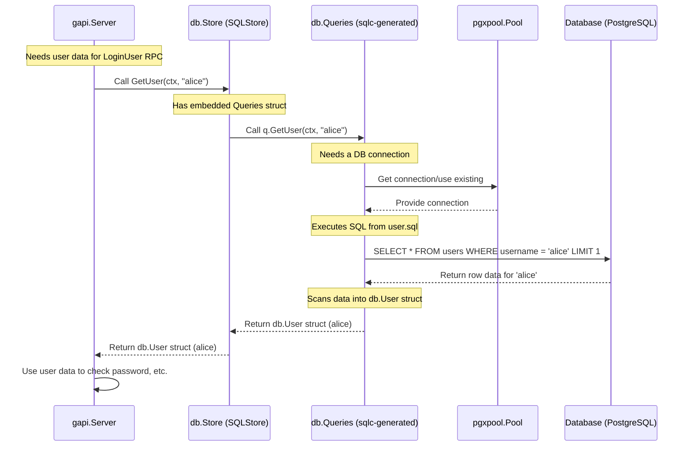

# Chapter 2: Database Access Layer (sqlc)

In [Chapter 1: gRPC API Service](01_grpc_api_service_.md), we learned how different parts of our SimpleBank system define how they talk to each other using gRPC. We saw how a request like `CreateUser` comes into the system via the `gapi` package.

But where does the user data actually get stored? How does our application interact with the bank's database – the secure vault holding all account information and the detailed ledger tracking every transaction?

That's the job of the **Database Access Layer (DBAL)**. Think of it as the strict, secure protocol the bank tellers (our application code) _must_ follow when accessing the vault (the database) or updating the ledger. It ensures every interaction is precise, safe, and consistent.

In SimpleBank, we use a fantastic tool called **`sqlc`** to help us build this layer.

## Why Do We Need a Special Layer?

Imagine our `gapi` code directly writing complex SQL commands to talk to the database. What could go wrong?

- **Typos:** A small typo in a SQL command could break the application or, worse, corrupt data.
- **Security:** Directly embedding SQL strings makes it easier to accidentally create security holes (like SQL injection).
- **Repetition:** We might write similar SQL queries in many different places, making updates difficult.
- **Complexity:** Managing database connections and handling errors correctly everywhere can be tricky.

The DBAL solves these problems by creating a dedicated "translator" between our Go application code and the database.

## Key Concepts: How `sqlc` Helps

Instead of writing Go code that _builds_ SQL strings, `sqlc` lets us do the opposite:

1.  **Write Pure SQL:** We write standard SQL queries in `.sql` files. These are the instructions for the database (e.g., "get user by username", "create a new account", "add money to balance").
2.  **Generate Go Code:** We run the `sqlc` tool. It reads our `.sql` files and automatically generates Go code (`.go` files) that executes these specific queries safely and efficiently.

This generated Go code provides:

- **Type Safety:** The Go functions have proper Go types for inputs and outputs. Your Go compiler will catch errors if you try to pass the wrong kind of data!
- **Boilerplate Reduction:** `sqlc` handles the tedious parts of preparing statements, executing queries, and scanning results into Go structs.
- **Clear Separation:** SQL logic stays in `.sql` files, and Go application logic stays in `.go` files.

Let's break down the components of our DBAL built with `sqlc`.

### 1. SQL Queries (`db/query/*.sql`)

This is where we define the exact SQL commands our application needs. Each file typically groups queries related to a specific table (e.g., `account.sql`, `user.sql`, `transfer.sql`).

Here's a very simple example from `db/query/user.sql`:

```sql
-- name: GetUser :one
SELECT * FROM users
WHERE username = $1 LIMIT 1;
```

- `-- name: GetUser :one`: This special comment tells `sqlc` to generate a function named `GetUser` that is expected to return exactly `:one` row.
- `SELECT * FROM users...`: This is standard SQL to retrieve all columns (`*`) for a user matching a given `username`. `$1` is a placeholder for the username value we'll provide later.

We write similar queries for creating, updating, and listing data for users, accounts, transfers, etc.

### 2. Generated Go Functions (`db/sqlc/*.sql.go`)

After writing the SQL, we run a command like `make sqlc` (which uses the `sqlc` tool configured in `sqlc.yaml`). This generates Go code based on those queries.

For the `GetUser` SQL query above, `sqlc` generates a file `db/sqlc/user.sql.go` containing (simplified):

```go
// Code generated by sqlc. DO NOT EDIT.
package db

import "context"

const getUser = `-- name: GetUser :one
SELECT username, hashed_password, full_name, email, -- ... other columns
FROM users
WHERE username = $1 LIMIT 1
`

// This function is GENERATED by sqlc from the GetUser query
func (q *Queries) GetUser(ctx context.Context, username string) (User, error) {
	// sqlc generates the code to safely execute the query
	row := q.db.QueryRow(ctx, getUser, username)
	var i User // The User struct (see next section)
	// sqlc generates the code to scan DB results into the User struct
	err := row.Scan(
		&i.Username,
		&i.HashedPassword,
		&i.FullName,
		&i.Email,
		// ... scan other fields
	)
	return i, err // Returns the User struct or an error
}
```

Notice how `sqlc` created a Go function `GetUser` that takes a `context.Context` and a `username` (string) and returns a `User` struct (or an error). We didn't write this Go function ourselves!

### 3. Database Models (`db/sqlc/models.go`)

How does the generated `GetUser` function know what a `User` looks like in Go? `sqlc` also analyzes our database schema (defined in `db/migration/*.sql` files) and generates Go structs that mirror our database tables.

Here's a simplified version of the `Account` struct generated in `db/sqlc/models.go`:

```go
// Code generated by sqlc. DO NOT EDIT.
package db

import "time"

// Account matches the 'accounts' table in our database
type Account struct {
	ID        int64     `json:"id"`
	Owner     string    `json:"owner"` // Matches the owner column (often username)
	Balance   int64     `json:"balance"` // Matches the balance column
	Currency  string    `json:"currency"` // Matches the currency column
	CreatedAt time.Time `json:"created_at"` // Matches the created_at column
}

// Similar structs exist for User, Transfer, Entry, etc.
```

These structs (`Account`, `User`, `Transfer`, `Entry`) are used as return types by the generated query functions (like `GetUser` returning `User`) and as parameters for creating or updating data.

### 4. The `Querier` Interface and `Store` (`db/sqlc/*.go`)

`sqlc` also generates an interface called `Querier` (`db/sqlc/querier.go`) that lists _all_ the database functions it created:

```go
// Code generated by sqlc. DO NOT EDIT.
package db

import "context"

// Querier lists all generated functions for database operations
type Querier interface {
	CreateAccount(ctx context.Context, arg CreateAccountParams) (Account, error)
	GetUser(ctx context.Context, username string) (User, error)
	CreateTransfer(ctx context.Context, arg CreateTransferParams) (Transfer, error)
	// ... many other functions generated from *.sql files
}

// var _ Querier = (*Queries)(nil) // Compile-time check
```

This interface is useful for defining dependencies and for testing (we can "mock" this interface).

SimpleBank then defines its own `Store` interface (`db/sqlc/store.go`) which _includes_ the `Querier` interface and adds methods for database transactions (more on this next!):

```go
package db

import (
	"context"
	"github.com/jackc/pgx/v5/pgxpool" // Database driver/pool
)

// Store defines all functions to execute db queries AND transactions
type Store interface {
	Querier // Embeds all methods like GetUser, CreateAccount, etc.
	// Add methods for complex operations (transactions)
	TransferTx(ctx context.Context, arg TransferTxParams) (TransferTxResult, error)
	CreateUserTx(ctx context.Context, arg CreateUserTxParams) (CreateUserTxResult, error)
	// ... other transaction methods
}

// SQLStore provides the actual implementation using a database connection pool
type SQLStore struct {
	connPool *pgxpool.Pool // Connection to the database
	*Queries               // Embeds the sqlc-generated query implementations
}

// NewStore creates a new SQLStore
func NewStore(connPool *pgxpool.Pool) Store {
	return &SQLStore{
		connPool: connPool,
		Queries:  New(connPool), // New() comes from sqlc-generated db.go
	}
}
```

The `SQLStore` is the concrete implementation that our application (like the `gapi` server) will use. It holds the database connection pool and the `sqlc`-generated `Queries` struct.

### 5. Atomic Transactions (`db/sqlc/tx_*.go`, `db/sqlc/exec_tx.go`)

What if we need to perform multiple database operations that must _all_ succeed or _all_ fail together? The classic example is transferring money:

1.  Debit money from Account A.
2.  Credit money to Account B.

If step 1 succeeds but step 2 fails (maybe the server crashes), we've just lost money! This is unacceptable in a bank.

Databases provide **transactions** to solve this. A transaction groups multiple operations. It only becomes permanent if _all_ operations within it complete successfully (a **commit**). If _any_ operation fails, the entire transaction is undone (a **rollback**), leaving the database as if nothing happened. This property is called **atomicity**.

In SimpleBank, we implement transaction logic in files like `db/sqlc/tx_transfer.go`. These functions use a helper `execTx` (`db/sqlc/exec_tx.go`) which handles the transaction begin, commit, and rollback logic.

```go
// --- File: db/sqlc/exec_tx.go ---
package db

import (
	"context"
	"fmt"
	// ... other imports
)

// execTx executes a function within a database transaction
func (store *SQLStore) execTx(ctx context.Context, fn func(*Queries) error) error {
	// Start a new database transaction
	tx, err := store.connPool.Begin(ctx)
	if err != nil {
		return err
	}

	// Get a Queries object that works with this transaction
	q := New(tx)
	// Execute the provided function (fn) with the transaction queries
	err = fn(q)
	if err != nil {
		// If fn returned an error, ROLLBACK the transaction
		if rbErr := tx.Rollback(ctx); rbErr != nil {
			return fmt.Errorf("tx err: %v, rb err: %v", err, rbErr)
		}
		return err // Return the original error
	}

	// If fn succeeded, COMMIT the transaction
	return tx.Commit(ctx)
}
```

This helper ensures our transaction logic is consistent.

## Use Case: Transferring Money

Let's see how the `TransferTx` function uses `sqlc`-generated code and the `execTx` helper to perform a money transfer safely.

```go
// --- File: db/sqlc/tx_transfer.go ---
package db

import "context"

// TransferTxParams contains the input parameters
type TransferTxParams struct {
	FromAccountID int64 `json:"from_account_id"`
	ToAccountID   int64 `json:"to_account_id"`
	Amount        int64 `json:"amount"`
}

// TransferTxResult contains the results
type TransferTxResult struct {
	Transfer    Transfer `json:"transfer"`
	FromAccount Account  `json:"from_account"`
	ToAccount   Account  `json:"to_account"`
	FromEntry   Entry    `json:"from_entry"` // Record of money leaving FromAccount
	ToEntry     Entry    `json:"to_entry"`   // Record of money entering ToAccount
}

// TransferTx performs a money transfer within a database transaction
func (store *SQLStore) TransferTx(ctx context.Context, arg TransferTxParams) (TransferTxResult, error) {
	var result TransferTxResult

	// Use the execTx helper to manage the transaction
	err := store.execTx(ctx, func(q *Queries) error {
		// 'q' operates within the transaction. All functions below must succeed.
		var err error

		// 1. Create the transfer record using sqlc-generated function
		result.Transfer, err = q.CreateTransfer(ctx, /* ...params... */)
		if err != nil { return err }

		// 2. Create the "from" entry record
		result.FromEntry, err = q.CreateEntry(ctx, /* ...params... */)
		if err != nil { return err }

		// 3. Create the "to" entry record
		result.ToEntry, err = q.CreateEntry(ctx, /* ...params... */)
		if err != nil { return err }

		// 4. Update balances (simplified - actual code handles locking)
		result.FromAccount, err = q.AddAccountBalance(ctx, /* ...params... */)
		if err != nil { return err }

		result.ToAccount, err = q.AddAccountBalance(ctx, /* ...params... */)
		if err != nil { return err }

		return nil // No error, transaction will be committed
	}) // End of execTx block

	// Return the results and any error from execTx
	return result, err
}
```

Inside the `execTx` block:

1.  We use `q.CreateTransfer`, `q.CreateEntry`, and `q.AddAccountBalance` – these are the **Go functions generated by `sqlc`** from our `.sql` files (`transfer.sql`, `entry.sql`, `account.sql`).
2.  If any of these `q.*` functions return an error, the anonymous function passed to `execTx` returns that error.
3.  The `execTx` helper catches this error and **rolls back** the transaction.
4.  If all `q.*` functions succeed, the anonymous function returns `nil`.
5.  The `execTx` helper sees no error and **commits** the transaction, making all changes permanent.

This ensures the entire transfer happens atomically – it either fully completes, or it doesn't happen at all, preventing data inconsistencies.

## Under the Hood: `gapi` Calling the `Store`

Let's visualize how the `gapi` layer (from Chapter 1) interacts with the `Store` (our DBAL) when it needs data, for example, getting a user.



1.  **`gapi` Request:** The `gapi` layer (e.g., in the `LoginUser` function) needs user details. It calls `server.store.GetUser(ctx, username)`.
2.  **`Store` Method:** The `SQLStore` implementation receives the call. Since it embeds the `*Queries` struct generated by `sqlc`, it effectively calls the `GetUser` method on that struct.
3.  **`sqlc` Generated Code:** The `GetUser` function in `db/sqlc/user.sql.go` executes.
4.  **Database Interaction:** It uses the `db.DBTX` interface (implemented by the connection pool `*pgxpool.Pool` or a transaction `pgx.Tx`) provided by `SQLStore` to send the actual `SELECT` query (defined in `db/query/user.sql`) to the PostgreSQL database.
5.  **Scanning Results:** It receives the raw data back from the database.
6.  **Go Struct:** It scans the data into the fields of a `db.User` struct (defined in `db/sqlc/models.go`).
7.  **Return:** It returns the populated `db.User` struct (or an error) back up the chain to `gapi`.

The beauty is that `gapi` only interacts with the clean `Store` interface and the Go structs/functions it provides, completely unaware of the underlying SQL execution details, which are neatly handled by `sqlc`'s generated code.

## Conclusion

The Database Access Layer, powered by `sqlc`, is a crucial component of SimpleBank. It acts as a secure and efficient intermediary between our application logic and the database.

We learned:

- Why a dedicated DBAL is important (safety, maintainability).
- How `sqlc` generates type-safe Go code from simple SQL queries.
- The roles of `.sql` query files, generated Go functions (`*.sql.go`), model structs (`models.go`), and the `Store` interface.
- How database transactions (`tx_*.go`, `execTx`) ensure atomicity for complex operations like money transfers.

By using `sqlc`, we write less boilerplate code, reduce potential errors, and keep our database interactions clean and separated from the rest of the application logic.

Now that we know how data gets into and out of the database safely, how do we make sure the data we _receive_ from the outside world (like in a `CreateUser` request) is valid _before_ we even try to store it? That's where the next layer comes in: [Input Data Validation](03_input_data_validation_.md).

---
