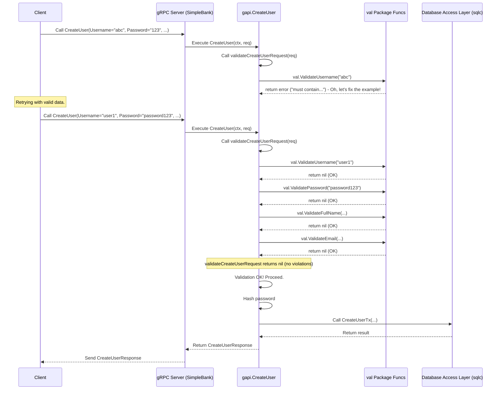

# Chapter 3: Input Data Validation

In [Chapter 2: Database Access Layer (sqlc)](02_database_access_layer__sqlc__.md), we saw how SimpleBank securely talks to its database using `sqlc` to manage user accounts, balances, and transfers. We learned how to ensure database operations happen correctly, like making sure a money transfer either fully completes or fails entirely.

But what about the data _before_ it even gets close to the database? Imagine someone trying to create a new user account. They send a request to our [gRPC API Service](01_grpc_api_service_.md) with a username, password, full name, and email.

What if the username is empty? Or the password is just "123"? Or the email address is just "hello"? If we blindly trust this input and try to save it, we'll likely run into errors, store nonsensical data, or even create security risks!

This is where **Input Data Validation** comes in. It acts like a strict quality control checker right at the entrance of our API.

## The Bank's Form Checker

Think about filling out a form at a real bank to open an account. Before the bank teller processes your request, they check the form:

- Is your name filled in?
- Is your address complete?
- Did you sign it?
- Is the account type selected?

If anything is missing or looks wrong, they hand it back to you to fix _before_ they try to create the account in their system.

Our Input Data Validation layer does exactly the same thing for API requests. Before the code in our `gapi` package (like the `CreateUser` function) even starts processing the request (like hashing the password or talking to the database), it first checks if the provided data meets the required rules.

## Why Validate?

- **Prevent Errors:** Catching bad data early stops errors later in the process (e.g., database errors because a required field is missing).
- **Ensure Data Quality:** Makes sure the data stored in our database is meaningful and follows the correct format (e.g., emails look like emails, usernames have specific characters).
- **Security:** Helps prevent certain types of attacks by rejecting malformed or malicious input.
- **Clear Feedback:** If a user provides bad data, we can immediately tell them _what_ is wrong (e.g., "Password must be at least 6 characters long"), instead of giving a vague internal error.

## How We Validate: The `val` Package

Instead of writing the same validation checks (like "is this string long enough?") over and over again in different API functions, we put our reusable validation logic in a dedicated package: `val`.

Inside `val/validator.go`, we have simple Go functions, each responsible for checking one specific rule.

Here's a function to validate a username:

```go
// --- File: val/validator.go ---
package val

import (
	"fmt"
	"regexp"
)

// Regular expression to check for allowed characters in username
var isValidUsername = regexp.MustCompile(`^[a-z0-9_]+$`).MatchString

// ValidateUsername checks if the username meets our rules
func ValidateUsername(value string) error {
	// Rule 1: Check length (must be between 3 and 100 chars)
	if err := ValidateString(value, 3, 100); err != nil {
		return err
	}
	// Rule 2: Check allowed characters (lowercase letters, digits, underscore)
	if !isValidUsername(value) {
		return fmt.Errorf("must contain only lowercase letters, digits, or underscore")
	}
	// If all rules pass, return nil (no error)
	return nil
}

// ValidateString is a helper used by other validators
func ValidateString(value string, minLength int, maxLength int) error {
	n := len(value)
	if n < minLength || n > maxLength {
		return fmt.Errorf("must contain from %d-%d characters", minLength, maxLength)
	}
	return nil
}
```

This `ValidateUsername` function first checks if the username has a valid length (using `ValidateString`), and then checks if it only contains allowed characters. If either check fails, it returns an `error` describing the problem. If both pass, it returns `nil` (which means "no error" in Go).

We have similar functions for other fields:

```go
// --- File: val/validator.go ---

// ValidatePassword checks only the length
func ValidatePassword(value string) error {
	return ValidateString(value, 6, 100) // Must be 6-100 characters
}

// ValidateEmail checks length and basic email format
func ValidateEmail(value string) error {
	if err := ValidateString(value, 3, 200); err != nil {
		return err
	}
	// Uses Go's built-in mail package to check format
	if _, err := mail.ParseAddress(value); err != nil {
		return fmt.Errorf("is not a valid email address")
	}
	return nil
}
```

These functions provide simple, reusable building blocks for checking common data types.

## Using Validators in the API (`gapi`)

Now, how do our gRPC API handlers in the `gapi` package use these validators? Let's look back at the `CreateUser` function from [Chapter 1: gRPC API Service](01_grpc_api_service_.md).

Inside `gapi/rpc_create_user.go`, before doing any real work, we call a helper function `validateCreateUserRequest`:

```go
// --- File: gapi/rpc_create_user.go ---
package gapi

import (
	// ... other imports
	"github.com/spaghetti-lover/simplebank/val" // Import our validation package
	// ...
	"google.golang.org/genproto/googleapis/rpc/errdetails" // For detailed errors
	"google.golang.org/grpc/codes"
	"google.golang.org/grpc/status"
)

func (server *Server) CreateUser(ctx context.Context, req *pb.CreateUserRequest) (*pb.CreateUserResponse, error) {
	// STEP 1: Validate the input request!
	violations := validateCreateUserRequest(req)
	if violations != nil {
		// If validation fails, return a specific error immediately
		return nil, invalidArgumentError(violations)
	}

	// STEP 2: If validation passed, proceed with hashing password, etc.
	hashedPassword, err := util.HashPassword(req.GetPassword())
	// ... (rest of the function: database call, etc.)
}
```

The very first thing `CreateUser` does is call `validateCreateUserRequest`. If that function returns anything other than `nil`, it means there was a validation error, and `CreateUser` immediately returns an error without proceeding further.

What does `validateCreateUserRequest` do? It calls the specific validation functions from our `val` package for each field in the request:

```go
// --- File: gapi/rpc_create_user.go ---

// validateCreateUserRequest checks all fields in the CreateUser request
func validateCreateUserRequest(req *pb.CreateUserRequest) (violations []*errdetails.BadRequest_FieldViolation) {
	// Validate username using val.ValidateUsername
	if err := val.ValidateUsername(req.GetUsername()); err != nil {
		violations = append(violations, fieldViolation("username", err))
	}

	// Validate password using val.ValidatePassword
	if err := val.ValidatePassword(req.GetPassword()); err != nil {
		violations = append(violations, fieldViolation("password", err))
	}

	// Validate full name using val.ValidateFullName
	if err := val.ValidateFullName(req.GetFullName()); err != nil {
		violations = append(violations, fieldViolation("full_name", err))
	}

	// Validate email using val.ValidateEmail
	if err := val.ValidateEmail(req.GetEmail()); err != nil {
		violations = append(violations, fieldViolation("email", err))
	}

	// Return the list of violations (will be nil if everything is valid)
	return violations
}
```

This function systematically checks each field (`username`, `password`, `full_name`, `email`) using the corresponding validator from the `val` package. If any validator returns an error, it records a "field violation" specifying which field was wrong and why.

## Reporting Errors Clearly

When validation fails, we don't want to just send back a generic "Something went wrong" message. We want to tell the caller exactly _what_ was wrong. gRPC has a standard way to report errors related to bad input arguments using the `InvalidArgument` status code and attaching details.

We use helper functions in `gapi` to create these structured error responses:

```go
// --- File: gapi/error.go (Simplified concept) ---

// fieldViolation creates a structured detail about one invalid field.
func fieldViolation(field string, err error) *errdetails.BadRequest_FieldViolation {
	return &errdetails.BadRequest_FieldViolation{
		Field:       field, // Which field failed (e.g., "password")
		Description: err.Error(), // Why it failed (e.g., "must contain from 6-100 characters")
	}
}

// invalidArgumentError creates the main gRPC status error for validation failures.
func invalidArgumentError(violations []*errdetails.BadRequest_FieldViolation) error {
	// Create a BadRequest message to hold all the field violations
	badRequest := &errdetails.BadRequest{FieldViolations: violations}
	// Create the gRPC status with code InvalidArgument
	statusInvalid := status.New(codes.InvalidArgument, "invalid parameters")

	// Attach the detailed BadRequest info to the status
	statusWithDetails, err := statusInvalid.WithDetails(badRequest)
	if err != nil {
		// If attaching details fails, return the original status
		return statusInvalid.Err()
	}

	// Return the status error with details included
	return statusWithDetails.Err()
}
```

When `CreateUser` calls `invalidArgumentError(violations)`, it sends back a response to the client that not only says "Invalid Argument" but also includes a list of exactly which fields were invalid and why. This is extremely helpful for whoever is calling our API!

## Under the Hood: The Validation Flow

Let's visualize the sequence of events when a `CreateUser` request arrives, focusing on the validation step:



_(Self-correction during diagramming: Initially showed a validation failure, but showing the success path after validation is more illustrative of the full flow)._

1.  **Request Arrives:** The gRPC server receives the `CreateUser` request.
2.  **Handler Called:** The `CreateUser` function in `gapi` starts executing.
3.  **Validation Check:** It immediately calls the `validateCreateUserRequest` helper.
4.  **Individual Checks:** The helper calls functions from the `val` package for each relevant field (username, password, etc.).
5.  **Validation Result:**
    - **If any `val` function returns an error:** `validateCreateUserRequest` collects these errors into violations and returns them. The main `CreateUser` function calls `invalidArgumentError` and returns the detailed gRPC error status to the client. The process stops here.
    - **If all `val` functions return `nil`:** `validateCreateUserRequest` returns `nil`. The main `CreateUser` function sees no violations and proceeds to the next steps (hashing the password, calling the [Database Access Layer (sqlc)](02_database_access_layer__sqlc__.md)).
6.  **Processing / Response:** If validation passed, the rest of the handler logic runs, interacts with the database, and eventually sends a successful response back to the client.

Validation acts as a crucial gatekeeper, ensuring only well-formed requests get processed further.

## Conclusion

Input Data Validation is our API's first line of defense. It acts as a quality control checker, ensuring that data coming into SimpleBank meets predefined rules _before_ we try to process it or save it.

We learned:

- Why validation is essential for preventing errors, ensuring data quality, and improving security.
- How we centralize reusable validation logic in the `val` package.
- How API handlers in `gapi` use the `val` package functions at the very beginning of their execution.
- How we provide clear, structured error messages back to the client when validation fails using gRPC status codes and details.

This validation layer ensures that the data passed down to our [Database Access Layer (sqlc)](02_database_access_layer__sqlc__.md) is already checked for correctness and format, making the rest of our application more robust and reliable.

So far, we've focused on the _internal_ communication using gRPC. But how do external clients, like a web browser or a mobile app, talk to our backend? They typically use HTTP/JSON. In the next chapter, we'll explore how we bridge the gap between the external HTTP world and our internal gRPC services using the [HTTP Gateway](04_http_gateway_.md).

---
