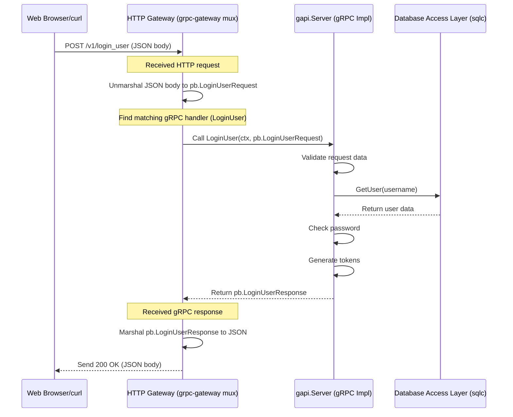

# Chapter 4: HTTP Gateway

In [Chapter 3: Input Data Validation](03_input_data_validation_.md), we learned how to protect our SimpleBank application by checking incoming data _before_ processing it, ensuring it meets our quality and security standards. We saw how our internal [gRPC API Service](01_grpc_api_service_.md) relies on valid data to function correctly.

But wait, gRPC is great for _internal_ communication between different parts of our system, or between our backend and specific clients built to understand gRPC. What about the rest of the world? How does a standard web browser, a mobile app using typical web requests, or even a simple command-line tool like `curl` talk to our bank? They usually speak **HTTP** and understand data formatted as **JSON**, not gRPC!

We need a way to translate between these two worlds. This is where the **HTTP Gateway** comes in.

## The Public-Facing Customer Service Desk

Think of our internal gRPC API (from Chapter 1) as the bank's super-efficient internal phone system, used by staff who know exactly how to operate it. The HTTP Gateway is like the bank's friendly, public-facing **customer service desk**.

Customers (web browsers, mobile apps) can walk up to this desk and make requests using familiar language (HTTP methods like POST, GET, and JSON data). The customer service representative (the HTTP Gateway) understands these requests and then translates them into the bank's internal procedures (calls the appropriate gRPC function). When the internal system responds, the representative translates the internal response back into a format the customer understands (JSON).

This gateway makes our bank's services accessible to a much wider audience without requiring everyone to learn the bank's internal gRPC "language".

## Key Concept: `grpc-gateway`

How do we build this translator? We use a clever library called **`grpc-gateway`**. It's a plugin for the Protocol Buffer compiler (`protoc`) that we already use.

Here's the magic:

1.  **Define Mappings:** We add special instructions (annotations) directly into our `.proto` files (the blueprints from Chapter 1). These annotations tell `grpc-gateway` how we want to map standard HTTP requests to our gRPC functions.
2.  **Generate Code:** We run `protoc` with the `grpc-gateway` plugin. It reads our `.proto` files and the annotations, and automatically generates Go code that acts as the HTTP-to-gRPC translator.

This means we don't have to manually write code to handle HTTP requests, parse JSON, figure out which gRPC function to call, and then format the response back to JSON. `grpc-gateway` does most of this heavy lifting for us!

### 1. Annotating `.proto` Files

Let's look at how we tell `grpc-gateway` how to handle the `LoginUser` RPC. We add an `option (google.api.http)` block to its definition in our `.proto` file:

```protobuf
// --- Simplified snippet from proto/service_simple_bank.proto ---

import "google/api/annotations.proto"; // Required for http options

// ... other definitions ...

service SimpleBank {
  rpc CreateUser (CreateUserRequest) returns (CreateUserResponse) {
    option (google.api.http) = {
      post: "/v1/create_user" // Map HTTP POST /v1/create_user ...
      body: "*"                 // ... using the entire request body as input
    };
  }

  rpc LoginUser (LoginUserRequest) returns (LoginUserResponse) {
    option (google.api.http) = {
      post: "/v1/login_user" // Map HTTP POST /v1/login_user ...
      body: "*"                // ... using the entire request body as input
    };
  }

  rpc VerifyEmail (VerifyEmailRequest) returns (VerifyEmailResponse) {
    option (google.api.http) = {
      get: "/v1/verify_email" // Map HTTP GET /v1/verify_email ...
      // Input fields come from query parameters here (defined in VerifyEmailRequest)
    };
  }

  // ... other RPCs ...
}
```

- `import "google/api/annotations.proto";`: We need this import to use the HTTP annotations.
- `option (google.api.http) = { ... };`: This block contains the mapping rules.
- `post: "/v1/login_user"`: This says: "If you receive an HTTP `POST` request at the path `/v1/login_user`, it corresponds to this `LoginUser` gRPC function."
- `get: "/v1/verify_email"`: This maps an HTTP `GET` request to the `VerifyEmail` RPC.
- `body: "*"`: This tells the gateway that the data for the gRPC request message (e.g., `LoginUserRequest`) should be taken from the body of the incoming HTTP request (usually JSON). For `GET` requests, parameters are typically mapped from the URL query string.

By adding these simple annotations, we've defined our public HTTP API!

### 2. Generated Gateway Code (`*.pb.gw.go`)

After adding the annotations, we re-run our code generation command (e.g., `make proto`). The `protoc-gen-grpc-gateway` plugin now generates a new file, typically named something like `pb/service_simple_bank.pb.gw.go`.

This file contains the generated Go code that implements the translation logic. We don't usually need to modify this file directly, but it's good to know it exists. It contains functions like `RegisterSimpleBankHandlerServer`:

```go
// --- File: pb/service_simple_bank.pb.gw.go ---
// Code generated by protoc-gen-grpc-gateway. DO NOT EDIT.
// ...

package pb

// ... imports ...

// RegisterSimpleBankHandlerServer registers the http handlers for service SimpleBank
// to "mux". It calls the SimpleBankServer directly (our gapi.Server).
func RegisterSimpleBankHandlerServer(ctx context.Context, mux *runtime.ServeMux, server SimpleBankServer) error {

	// Generated code maps HTTP path & method to the correct server function
	mux.Handle("POST", pattern_SimpleBank_LoginUser_0, func(w http.ResponseWriter, req *http.Request, pathParams map[string]string) {
		// ... generated code reads HTTP request body (JSON) ...
		// ... unmarshals JSON into protoReq (*LoginUserRequest) ...
		// ... calls the actual gRPC implementation: server.LoginUser(ctx, &protoReq) ...
		// ... gets the response (*LoginUserResponse) ...
		// ... marshals response into JSON and writes HTTP response ...
	})

    // ... similar blocks generated for CreateUser, VerifyEmail, etc. ...

	return nil
}

// ... other generated helper functions and variables ...
```

This generated function takes our actual gRPC server implementation (`server SimpleBankServer`, which is our `gapi.Server` instance) and registers specific HTTP routes (like `POST /v1/login_user`) with a provided HTTP request multiplexer (`mux`). The code inside handles the translation for each route.

### 3. Running the Gateway Server (`main.go`)

Finally, we need to set up and run an actual HTTP server that uses this generated gateway code. We do this in our `main.go` file, within the `runGatewayServer` function:

```go
// --- File: main.go (inside runGatewayServer) ---
package main

import (
	// ... other imports
	"github.com/grpc-ecosystem/grpc-gateway/v2/runtime"
	"github.com/spaghetti-lover/simplebank/gapi"
	"github.com/spaghetti-lover/simplebank/pb"
	"google.golang.org/protobuf/encoding/protojson"
	// ...
)

func runGatewayServer(
	ctx context.Context,
	waitGroup *errgroup.Group,
	config util.Config,
	store db.Store,
	taskDistributor worker.TaskDistributor,
) {
	// Create an instance of our gRPC server implementation (gapi.Server)
	server, err := gapi.NewServer(config, store, taskDistributor)
	// ... error handling ...

	// Create a new gRPC Gateway multiplexer (router)
	// Configures how JSON <-> Protobuf conversion happens
	jsonOption := runtime.WithMarshalerOption(runtime.MIMEWildcard, &runtime.JSONPb{
		MarshalOptions: protojson.MarshalOptions{ UseProtoNames: true },
		UnmarshalOptions: protojson.UnmarshalOptions{ DiscardUnknown: true },
	})
	grpcMux := runtime.NewServeMux(jsonOption)

	// Register the generated HTTP handlers with the multiplexer
	// This connects HTTP routes to our gapi.Server methods
	err = pb.RegisterSimpleBankHandlerServer(ctx, grpcMux, server)
	// ... error handling ...

	// Create a standard Go HTTP multiplexer
	mux := http.NewServeMux()
	// Tell it to send all incoming requests to our gRPC Gateway multiplexer
	mux.Handle("/", grpcMux)

	// Start a standard Go HTTP server
	httpServer := &http.Server{
		Handler: mux, // Use our configured multiplexer
		Addr:    config.HTTPServerAddress, // Get address from config
	}

	// Run the HTTP server in a separate goroutine
	waitGroup.Go(func() error {
		log.Info().Msgf("start HTTP gateway server at %s", httpServer.Addr)
		err = httpServer.ListenAndServe()
		// ... error handling & shutdown logic ...
		return nil
	})

    // ... graceful shutdown logic ...
}
```

This code does the following:

1.  Creates the main gRPC server (`gapi.Server`) which contains the actual logic.
2.  Creates a `grpc-gateway` multiplexer (`grpcMux`) which knows how to handle JSON.
3.  Calls the generated `pb.RegisterSimpleBankHandlerServer` function, passing it the `grpcMux` and our `gapi.Server`. This wires everything up.
4.  Creates a standard HTTP server (`httpServer`) and tells it to use `grpcMux` to handle requests.
5.  Starts the `httpServer` to listen for incoming HTTP connections on the configured address (e.g., `0.0.0.0:8080`).

Now, our bank has its public customer service desk open for business!

## Use Case: Logging In via HTTP

Let's imagine a web frontend wants to log a user in. Instead of needing a special gRPC client, it can just make a standard HTTP request:

**Request:**

- Method: `POST`
- URL: `http://localhost:8080/v1/login_user` (assuming the gateway runs on port 8080)
- Headers: `Content-Type: application/json`
- Body (JSON):
  ```json
  {
    "username": "alice",
    "password": "password123"
  }
  ```

**What Happens:**

1.  The HTTP Gateway server (`httpServer` in `main.go`) receives this request.
2.  It passes the request to the `grpcMux`.
3.  `grpcMux` sees the `POST` method and `/v1/login_user` path and knows (thanks to the generated code in `pb/service_simple_bank.pb.gw.go` and the annotation in the `.proto` file) that this corresponds to the `LoginUser` RPC.
4.  The generated code inside `RegisterSimpleBankHandlerServer` takes over:
    - It reads the JSON body `{"username": "alice", "password": "password123"}`.
    - It converts (unmarshals) this JSON into the `pb.LoginUserRequest` Protobuf message.
    - It calls the _actual_ `LoginUser` method on our `gapi.Server` instance, passing the populated `pb.LoginUserRequest`.
5.  Our `gapi.Server.LoginUser` function (in `gapi/rpc_login_user.go`) runs its logic:
    - It performs [Input Data Validation](03_input_data_validation_.md).
    - It interacts with the [Database Access Layer (sqlc)](02_database_access_layer__sqlc__.md) to find the user and check the password.
    - It generates an access token (details in the next chapter!).
    - It returns a `pb.LoginUserResponse` Protobuf message containing the user details and the access token.
6.  The generated gateway code receives the `pb.LoginUserResponse`.
7.  It converts (marshals) the `pb.LoginUserResponse` into JSON format.
8.  It sends an HTTP response back to the web frontend.

**Response:**

- Status Code: `200 OK`
- Headers: `Content-Type: application/json`
- Body (JSON):
  ```json
  {
    "user": {
      "username": "alice",
      "fullName": "Alice Wonderland",
      "email": "alice@email.com",
      "passwordChangedAt": "...",
      "createdAt": "..."
    },
    "sessionId": "...",
    "accessToken": "a_very_long_access_token_string",
    "refreshToken": "a_very_long_refresh_token_string",
    "accessTokenExpiresAt": "...",
    "refreshTokenExpiresAt": "..."
  }
  ```

The web frontend received a standard JSON response, completely unaware of the internal gRPC communication!

## Under the Hood: The Translation Flow

Let's visualize the journey of that HTTP login request:



1.  **HTTP Request:** The client sends an HTTP POST request with JSON data to the gateway's address.
2.  **Gateway Receives:** The Go HTTP server passes the request to the `grpc-gateway` multiplexer (`grpcMux`).
3.  **Unmarshal & Route:** The generated gateway code identifies the target RPC (`LoginUser`), reads the JSON body, and converts it into the corresponding Protobuf request message (`pb.LoginUserRequest`).
4.  **Call gRPC Implementation:** The gateway code calls the actual `LoginUser` method on the `gapi.Server` instance, just like a native gRPC client would.
5.  **Business Logic:** The `gapi.LoginUser` function executes, validating input, interacting with the database via the [Database Access Layer (sqlc)](02_database_access_layer__sqlc__.md), and preparing the Protobuf response (`pb.LoginUserResponse`).
6.  **gRPC Response:** The `gapi.LoginUser` function returns the `pb.LoginUserResponse` to the gateway code.
7.  **Marshal & Respond:** The gateway code converts the Protobuf response back into JSON and sends it as the body of the HTTP response back to the original client.

The `grpc-gateway` library seamlessly handles the translation in both directions.

## Conclusion

The HTTP Gateway is a crucial component that makes our internal gRPC services accessible to the wider world using standard HTTP and JSON. By leveraging `grpc-gateway`, we can:

- Define HTTP endpoints (like `POST /v1/login_user`) using simple annotations in our `.proto` files.
- Automatically generate the Go code that translates between HTTP/JSON and gRPC/Protobuf.
- Run a standard HTTP server that serves these endpoints.
- Keep our core application logic clean within the [gRPC API Service](01_grpc_api_service_.md) (`gapi` package), serving both gRPC and HTTP clients through this gateway.

This acts as the public interface, the "customer service desk," for our SimpleBank backend.

Now that we have opened up our API to HTTP requests, we face a critical question: how do we ensure that only authorized users can perform actions like checking balances or transferring money? We need a security guard at the door. That's the topic of our next chapter: [Authentication & Authorization (Token-Based)](05_authentication___authorization__token_based__.md).

---
