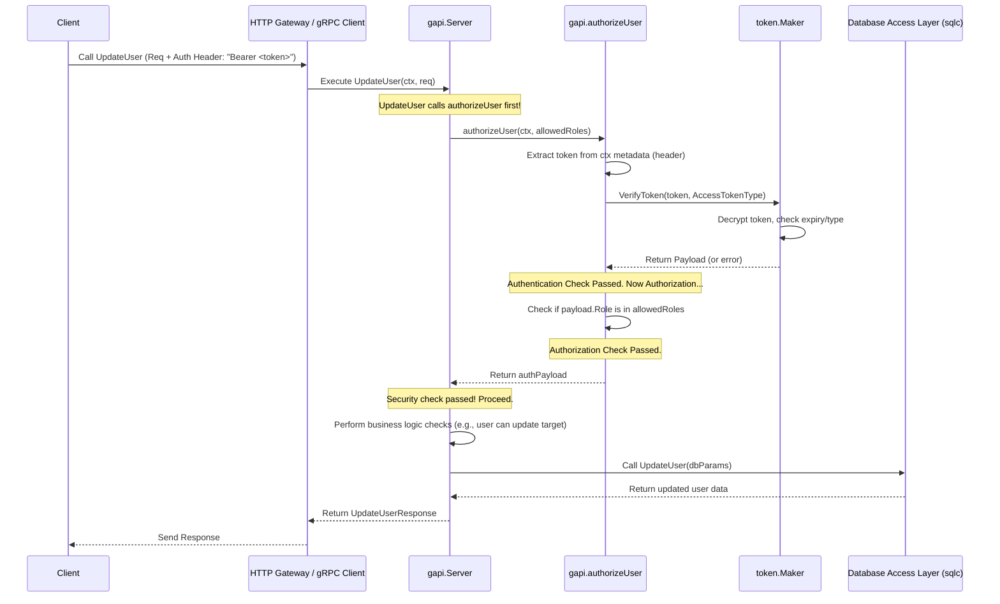

# Chapter 5: Authentication & Authorization (Token-Based)

In the last chapter, [HTTP Gateway](04_http_gateway_.md), we opened up our SimpleBank services to the outside world using standard HTTP and JSON. Now, anyone can _try_ to talk to our bank's API! But just like a real bank, we can't let just anyone walk in and access sensitive information or perform actions like transferring money. We need security!

Imagine trying to check your account balance. You wouldn't want someone else to be able to see it, right? The bank needs to know two things:

1.  **Authentication:** Are you _really_ who you say you are? (Verifying your identity)
2.  **Authorization:** _Are you allowed_ to do what you're asking to do? (Checking your permissions)

This chapter explains how SimpleBank handles this security using a common technique: **Token-Based Authentication and Authorization**.

## The Problem: Protecting Our Bank's API

When a user successfully logs in, we need a way to "remember" that they are logged in for future requests. We also need to know _who_ they are and what they are allowed to do (their "role", like a regular customer or a bank employee).

We can't just trust the user to tell us "Hi, I'm Alice!" on every request. We need proof!

## Solution: Security Tokens (Like Temporary ID Badges)

The solution is to issue a **security token** when the user logs in successfully. Think of this token like a temporary digital ID badge.

- **Issued After Login:** When you provide the correct username and password, the system gives you this special badge (a long string of characters).
- **Contains Information:** The badge secretly encodes information like your username, your role, and when the badge expires.
- **Presented with Requests:** For any action that requires security (like checking balance or transferring money), you must present this badge along with your request.
- **Verification:** The system checks the badge: Is it valid? Has it expired? Does the person holding this badge have permission for this specific action?

SimpleBank uses **Paseto** (Platform-Agnostic Security Tokens) for this, although another popular alternative is JWT (JSON Web Tokens). The core idea is the same: a secure, temporary credential.

## Key Concepts

Let's break down how this system works in SimpleBank.

### 1. Token Creation (`token` package)

When a user logs in successfully, the system needs to generate this token (ID badge). This is handled by the `token` package.

- **Secret Key:** The system uses a secret key (known only to the server) to create and sign the tokens. This prevents anyone else from creating fake tokens.
- **Payload:** The information embedded in the token (username, role, expiration time) is called the payload.
- **Maker Interface:** We define a `Maker` interface (`token/maker.go`) that specifies what actions our token generator must support (creating and verifying tokens).

```go
// --- File: token/maker.go ---
package token

import "time"

// Maker is an interface for managing tokens
type Maker interface {
	// CreateToken creates a new token for a specific username, role, and duration
	CreateToken(username string, role string, duration time.Duration, tokenType TokenType) (string, *Payload, error)

	// VerifyToken checks if the token is valid or not
	VerifyToken(token string, tokenType TokenType) (*Payload, error)
}
```

This interface ensures that whether we use Paseto or JWT, the rest of our application interacts with the token logic in the same way.

- **Paseto Implementation:** The `token/paseto_maker.go` file provides the actual implementation using Paseto.

```go
// --- File: token/paseto_maker.go ---
package token

import (
	// ... imports
	"github.com/o1egl/paseto"
)

// PasetoMaker implements the Maker interface using Paseto
type PasetoMaker struct {
	paseto       *paseto.V2
	symmetricKey []byte // The secret key!
}

// NewPasetoMaker creates a new PasetoMaker instance
func NewPasetoMaker(symmetricKey string) (Maker, error) {
	// ... (Check key size) ...

	maker := &PasetoMaker{
		paseto:       paseto.NewV2(),
		symmetricKey: []byte(symmetricKey),
	}
	return maker, nil
}

// CreateToken generates a new Paseto token
func (maker *PasetoMaker) CreateToken(username string, role string, duration time.Duration, tokenType TokenType) (string, *Payload, error) {
	// Create the payload data (username, role, expiry, etc.)
	payload, err := NewPayload(username, role, duration, tokenType)
	// ... error handling ...

	// Encrypt the payload using the secret key to create the token string
	return maker.paseto.Encrypt(maker.symmetricKey, payload, nil)
}
```

When `CreateToken` is called (usually during login), it packages the user's details and expiry time into a `Payload`, then uses the secret `symmetricKey` to encrypt and sign this information, producing the final token string.

We typically issue two types of tokens:

- **Access Token:** Short-lived (e.g., 15 minutes). Used to access protected resources.
- **Refresh Token:** Longer-lived (e.g., 7 days). Used to get a new access token when the old one expires, without needing to log in again.

### 2. Token Verification (`token` package)

When a request comes in for a protected operation, the system needs to check the presented token (the ID badge). The `token` package also handles this.

```go
// --- File: token/paseto_maker.go ---

// VerifyToken checks if a Paseto token is valid
func (maker *PasetoMaker) VerifyToken(token string, tokenType TokenType) (*Payload, error) {
	payload := &Payload{} // Where the decoded info will go

	// Decrypt the token using the secret key and decode the payload
	err := maker.paseto.Decrypt(token, maker.symmetricKey, payload, nil)
	if err != nil {
		return nil, ErrInvalidToken // Failed decryption means invalid token
	}

	// Check if the token has expired or if it's the correct type
	err = payload.Valid(tokenType)
	if err != nil {
		return nil, err // e.g., ErrExpiredToken
	}

	// If everything checks out, return the decoded payload
	return payload, nil
}
```

`VerifyToken` uses the same secret key to decrypt the token. If successful, it means the token was genuinely issued by our server. It then checks the expiration time and token type. If valid, it returns the payload containing the user's information (username, role).

### 3. The Security Guard: Middleware (`gapi/authorization.go`)

How do we ensure _every_ protected request gets checked? We use a **gRPC interceptor** (or **middleware** in the HTTP world). Think of this as a security guard standing at the entrance to all secure areas (our protected API functions).

The `gapi/authorization.go` file contains this logic for our gRPC API. Before any protected RPC function (like `UpdateUser`) is executed, this interceptor runs first.

```go
// --- File: gapi/authorization.go ---
package gapi

import (
	"context"
	"fmt"
	"strings"

	"github.com/spaghetti-lover/simplebank/token"
	"google.golang.org/grpc/metadata" // To read request headers
)

const (
	authorizationHeader = "authorization" // Standard header name
	authorizationBearer = "bearer"        // Standard type prefix
)

// authorizeUser is the core function that checks the token and permissions
func (server *Server) authorizeUser(ctx context.Context, accessibleRoles []string) (*token.Payload, error) {
	// 1. Get metadata (headers) from the incoming request context
	md, ok := metadata.FromIncomingContext(ctx)
	// ... basic checks ...

	// 2. Extract the "authorization" header value
	values := md.Get(authorizationHeader)
	// ... basic checks ...

	// 3. Parse the header (expecting "bearer <token>")
	authHeader := values[0]
	fields := strings.Fields(authHeader)
	// ... format checks ...

	// 4. Check if it's a "Bearer" token
	authType := strings.ToLower(fields[0])
	if authType != authorizationBearer {
		return nil, fmt.Errorf("unsupported authorization type: %s", authType)
	}

	// 5. Get the actual token string
	accessToken := fields[1]

	// 6. Verify the token using our token.Maker
	payload, err := server.tokenMaker.VerifyToken(accessToken, token.TokenTypeAccessToken)
	if err != nil {
		return nil, fmt.Errorf("invalid access token: %s", err) // Authentication failed
	}

	// 7. Check if the user's role has permission for this operation
	if !hasPermission(payload.Role, accessibleRoles) {
		return nil, fmt.Errorf("permission denied") // Authorization failed
	}

	// 8. Success! Return the token payload (contains user info)
	return payload, nil
}

// hasPermission checks if the user's role is in the list of allowed roles
func hasPermission(userRole string, accessibleRoles []string) bool {
	// ... (loop through accessibleRoles and check if userRole matches) ...
	return true // Simplified for example
}
```

This function performs these crucial steps:

1.  Extracts the token string from the `Authorization` header of the incoming request.
2.  Uses the `tokenMaker` (which we initialized in `gapi/server.go`) to verify the token. **This is Authentication.**
3.  If the token is valid, it checks if the `payload.Role` is present in the `accessibleRoles` list passed by the specific RPC handler being protected. **This is Authorization.**
4.  If both checks pass, it returns the `payload` (containing user identity). Otherwise, it returns an error, stopping the request from proceeding.

## Use Case Walkthrough

Let's see how these pieces work together.

### 1. Logging In

When a user calls the `LoginUser` RPC (via gRPC or the [HTTP Gateway](04_http_gateway_.md)):

```go
// --- File: gapi/rpc_login_user.go ---
func (server *Server) LoginUser(ctx context.Context, req *pb.LoginUserRequest) (*pb.LoginUserResponse, error) {
	// ... (Validate input request) ...

	// 1. Find user in database
	user, err := server.store.GetUser(ctx, req.GetUsername())
	// ... (Handle user not found) ...

	// 2. Check password
	err = util.CheckPassword(req.Password, user.HashedPassword)
	// ... (Handle incorrect password) ...

	// 3. Create Access Token
	accessToken, accessPayload, err := server.tokenMaker.CreateToken(
		user.Username,
		user.Role, // << User's role included here
		server.config.AccessTokenDuration,
		token.TokenTypeAccessToken,
	)
	// ... (Handle token creation error) ...

	// 4. Create Refresh Token (similar call to CreateToken)
	// ...

	// 5. Store refresh token session in DB
	// ...

	// 6. Return response including tokens
	rsp := &pb.LoginUserResponse{
		User:                  convertUser(user),
		AccessToken:           accessToken, // The newly created badge!
		RefreshToken:          refreshToken,
		AccessTokenExpiresAt:  timestamppb.New(accessPayload.ExpiredAt),
		// ... other fields ...
	}
	return rsp, nil
}
```

After verifying the user's password, `LoginUser` calls `server.tokenMaker.CreateToken` to generate the access and refresh tokens. These tokens are then sent back to the client in the response. The client must store these tokens securely.

### 2. Accessing a Protected Resource (e.g., Update User)

Now, imagine the logged-in user wants to update their full name by calling the `UpdateUser` RPC. The client must include the previously received `accessToken` in the `Authorization` header of the request (e.g., `Authorization: Bearer <the_access_token_string>`).

```go
// --- File: gapi/rpc_update_user.go ---
func (server *Server) UpdateUser(ctx context.Context, req *pb.UpdateUserRequest) (*pb.UpdateUserResponse, error) {
	// === SECURITY CHECK FIRST! ===
	// Specify which roles can access this RPC
	allowedRoles := []string{util.BankerRole, util.DepositorRole}
	authPayload, err := server.authorizeUser(ctx, allowedRoles)
	if err != nil {
		// If authorizeUser fails, return an unauthenticated/permission error
		return nil, unauthenticatedError(err)
	}
	// =============================

	// If authorizeUser succeeded, authPayload contains verified user info.
	// Now, perform additional checks if needed (e.g., can this user update *this specific* other user?)
	if authPayload.Role != util.BankerRole && authPayload.Username != req.GetUsername() {
		return nil, status.Errorf(codes.PermissionDenied, "cannot update other user's info")
	}

	// ... (Validate input request) ...

	// Proceed with the actual update logic using the database
	arg := db.UpdateUserParams{ Username: req.GetUsername(), /* ... other fields ... */ }
	user, err := server.store.UpdateUser(ctx, arg)
	// ... (Handle database errors) ...

	// Return the successful response
	rsp := &pb.UpdateUserResponse{ User: convertUser(user) }
	return rsp, nil
}
```

The _very first thing_ `UpdateUser` does is call `server.authorizeUser(ctx, allowedRoles)`. It passes the list of roles that are allowed to call this function (`BankerRole`, `DepositorRole`).

- `authorizeUser` extracts the token from the header.
- It verifies the token using `tokenMaker.VerifyToken`.
- It checks if the role found in the token (`payload.Role`) is either `BankerRole` or `DepositorRole`.
- If any check fails, `authorizeUser` returns an error, and `UpdateUser` immediately stops and returns an error to the client.
- If successful, `authorizeUser` returns the `authPayload`, which contains the _authenticated_ user's details (like `authPayload.Username` and `authPayload.Role`). The `UpdateUser` function can then safely use this information for further logic (like checking if a regular user is trying to update someone else's profile).

This pattern ensures that security checks happen consistently before any sensitive operation proceeds.

## Under the Hood: Request Flow with Authorization

Let's visualize how a request to a protected endpoint like `UpdateUser` flows through the system:



1.  **Request:** The client sends the `UpdateUser` request, including the `Authorization: Bearer <token>` header.
2.  **Handler Entry:** The `gapi.UpdateUser` function starts.
3.  **Authorization Call:** It immediately calls `gapi.authorizeUser`.
4.  **Token Extraction:** `authorizeUser` reads the token from the request metadata.
5.  **Token Verification:** It calls `tokenMaker.VerifyToken`.
6.  **Token Logic:** The `token.Maker` implementation (e.g., `PasetoMaker`) decrypts the token using the secret key and checks its validity and expiry. It returns the payload (or an error).
7.  **Permission Check:** If verification succeeded, `authorizeUser` checks if the user's role (from the payload) is allowed for this specific operation.
8.  **Authorization Result:** `authorizeUser` returns the payload (if successful) or an error (if authentication or authorization failed).
9.  **Handler Continues:** If `authorizeUser` succeeded, the `UpdateUser` function proceeds with its main logic, trusting the identity provided in the `authPayload`. If it failed, `UpdateUser` returns an error immediately.

## Conclusion

Authentication and Authorization are fundamental to API security. SimpleBank uses a token-based approach:

- **Authentication:** When a user logs in, they receive a temporary, digitally signed token (like an ID badge) created using a secret key (`token` package).
- **Authorization:** For protected requests, the client presents this token. Middleware (`gapi/authorization.go`) intercepts the request, verifies the token's authenticity and expiry (`token.Maker.VerifyToken`), and checks if the user's role (encoded in the token) has permission to perform the requested action.

This ensures that only valid, logged-in users with the correct permissions can access sensitive data or perform restricted operations in our bank.

We've now seen how requests come in ([gRPC API Service](01_grpc_api_service_.md)), how data is validated ([Input Data Validation](03_input_data_validation_.md)), how external clients can connect ([HTTP Gateway](04_http_gateway_.md)), how data is stored ([Database Access Layer (sqlc)](02_database_access_layer__sqlc__.md)), and how access is secured (this chapter).

But some tasks, like sending a welcome email after user registration, shouldn't slow down the main request. How can we run tasks like these in the background? That's the focus of our next chapter: [Asynchronous Task Processing (Worker)](06_asynchronous_task_processing__worker__.md).

---
