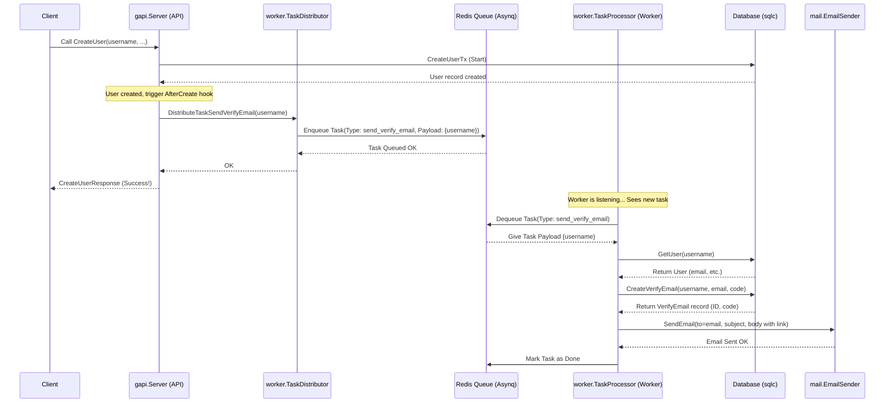

# Chapter 6: Asynchronous Task Processing (Worker)

Welcome back! In [Chapter 5: Authentication & Authorization (Token-Based)](05_authentication___authorization__token_based__.md), we learned how to secure our SimpleBank API, ensuring only logged-in users with the right permissions can access sensitive operations. We saw how tokens act like temporary ID badges.

Now, let's think about the user experience. When someone signs up for SimpleBank using our `CreateUser` API ([Chapter 1: gRPC API Service](01_grpc_api_service_.md)), we want to send them a welcome/verification email. Should we make the user wait for the email to be sent _before_ confirming their signup was successful? Sending an email can sometimes be slow – what if the email server is delayed? The user might think the signup failed!

This is where **Asynchronous Task Processing** comes in. It's like having a separate mailroom in our bank.

## The Mailroom Analogy

Imagine you go to the bank teller (our API server) to open an account (call `CreateUser`). The teller does the essential work quickly: checks your ID, enters your details, and creates the account in the system. They give you your account number and say, "Welcome! Your account is ready."

Meanwhile, the teller also writes a note: "Send a welcome package to this new customer" and puts it in an outgoing mailbox. Later, the bank's mailroom staff (our **Worker**) picks up this note, prepares the welcome package (composes and sends the email), and mails it.

Crucially, _you_ didn't have to wait at the counter while the mailroom did its job. The teller finished the _essential_ part quickly, and the less time-sensitive task (sending the package/email) happened later, in the background.

This is exactly what our asynchronous task processor does: it handles tasks that don't need to block the main user request.

## Key Concepts

Let's break down the components involved:

1.  **Message Queue (The Mailbox):** This is a place where we put messages (tasks) that need to be processed later. Think of it as the mailroom's "incoming tasks" tray. In SimpleBank, we use **Redis** as our message queue system.
2.  **Asynq (The Mailroom Rules):** This is the specific Go library we use to interact with the Redis message queue. It provides rules and tools for adding tasks to the queue and processing them reliably.
3.  **Task (The Note/Instruction):** A specific job to be done, like "send verification email". It includes:
    - A **Type:** A name identifying the kind of task (e.g., `task:send_verify_email`).
    - A **Payload:** The data needed to perform the task (e.g., the `username` of the new user).
4.  **Task Distributor (The Teller):** The part of our main application (specifically, our `gapi` server from [Chapter 1: gRPC API Service](01_grpc_api_service_.md)) that _creates_ a task and _adds_ it to the message queue (puts the note in the mailbox).
5.  **Task Processor / Worker (The Mailroom Staff):** A _separate process_ (a program running independently from the main API server) that constantly watches the message queue. When a new task appears, it picks it up, reads the instructions, and performs the actual work (e.g., sends the email).

## How We Use It: Sending Verification Emails

Let's revisit the `CreateUser` use case.

### 1. Defining the Task

First, we need to define what information our "send verification email" task needs. We create a Go struct for the payload in `worker/task_send_verify_email.go`:

```go
// --- File: worker/task_send_verify_email.go ---
package worker

// TaskSendVerifyEmail defines the type name for this task
const TaskSendVerifyEmail = "task:send_verify_email"

// PayloadSendVerifyEmail contains the data needed for the task
type PayloadSendVerifyEmail struct {
	Username string `json:"username"` // We only need the username
}
```

- `TaskSendVerifyEmail`: A constant string defining the unique name (type) for this task.
- `PayloadSendVerifyEmail`: A struct holding the data. Here, we just need the `Username` to look up the user's email address later.

### 2. Adding the Task to the Queue (Distributing)

Remember our `CreateUser` function in `gapi/rpc_create_user.go`? We saw in [Chapter 2: Database Access Layer (sqlc)](02_database_access_layer__sqlc__.md) that it uses a database transaction (`CreateUserTx`) which allows performing actions _after_ the user is successfully created (`AfterCreate`). This is the perfect place to queue our email task!

```go
// --- File: gapi/rpc_create_user.go ---
package gapi

import (
	// ... other imports
	"github.com/hibiken/asynq"
	db "github.com/spaghetti-lover/simplebank/db/sqlc"
	"github.com/spaghetti-lover/simplebank/worker" // Import worker package
	// ...
)

func (server *Server) CreateUser(ctx context.Context, req *pb.CreateUserRequest) (*pb.CreateUserResponse, error) {
	// ... (validation, password hashing) ...

	// Prepare arguments for the database transaction
	arg := db.CreateUserTxParams{
		CreateUserParams: db.CreateUserParams{ /* ... user details ... */ },

		// This function runs AFTER the user is created in the DB
		AfterCreate: func(user db.User) error {
			// Define the payload for our email task
			taskPayload := &worker.PayloadSendVerifyEmail{
				Username: user.Username,
			}
			// Define options (e.g., retry 10 times, wait 10s before processing)
			opts := []asynq.Option{
				asynq.MaxRetry(10),
				asynq.ProcessIn(10 * time.Second),
				asynq.Queue(worker.QueueCritical), // Use the "critical" queue
			}

			// Send the task to the queue via the TaskDistributor
			return server.taskDistributor.DistributeTaskSendVerifyEmail(ctx, taskPayload, opts...)
		},
	}

	// Execute the transaction (creates user AND queues the task)
	txResult, err := server.store.CreateUserTx(ctx, arg)
	// ... (error handling) ...

	rsp := &pb.CreateUserResponse{ /* ... response ... */ }
	return rsp, nil
}
```

- Inside `AfterCreate`, we create the `taskPayload` with the new user's username.
- We access `server.taskDistributor`, which is an instance of our `TaskDistributor` interface (we'll see how it's created later).
- We call `DistributeTaskSendVerifyEmail`, passing the payload and options. This method, implemented in `worker/task_send_verify_email.go`, uses the Asynq client to add the task to the Redis queue.

The `CreateUser` API call can now return quickly to the user, because putting the task in the queue is very fast. The actual email sending will happen later.

### 3. Processing the Task (The Worker)

Now, we need the separate "mailroom staff" process – the **Worker**. This worker process is started in our `main.go` (using `runTaskProcessor`) and runs independently. It listens to the Redis queue for tasks.

The core logic for _handling_ the task is also in `worker/task_send_verify_email.go`:

```go
// --- File: worker/task_send_verify_email.go ---
package worker

import (
	// ... imports
	"encoding/json"
	"fmt"
	"github.com/hibiken/asynq"
	"github.com/rs/zerolog/log"
	db "github.com/spaghetti-lover/simplebank/db/sqlc" // Need DB access
	"github.com/spaghetti-lover/simplebank/util"
)

// This function is registered with the worker to handle tasks of type TaskSendVerifyEmail
func (processor *RedisTaskProcessor) ProcessTaskSendVerifyEmail(ctx context.Context, task *asynq.Task) error {
	var payload PayloadSendVerifyEmail
	// 1. Decode the task payload (get the username)
	if err := json.Unmarshal(task.Payload(), &payload); err != nil {
		return fmt.Errorf("failed to unmarshal payload: %w", asynq.SkipRetry)
	}

	// 2. Get user details from DB (we need the email address)
	user, err := processor.store.GetUser(ctx, payload.Username)
	if err != nil {
		// Note: If user not found, maybe don't retry?
		return fmt.Errorf("failed to get user: %w", err)
	}

	// 3. Create a verification record in the DB
	verifyEmail, err := processor.store.CreateVerifyEmail(ctx, db.CreateVerifyEmailParams{
		Username:   user.Username,
		Email:      user.Email,
		SecretCode: util.RandomString(32), // Generate a secret code
	})
	// ... error handling ...

	// 4. Construct the email content (subject, body with verification link)
	subject := "Welcome to Simple Bank"
	verifyUrl := fmt.Sprintf("http://localhost:8080/v1/verify_email?email_id=%d&secret_code=%s",
		verifyEmail.ID, verifyEmail.SecretCode) // TODO: Use config for base URL
	content := fmt.Sprintf(`Hello %s,<br/>...Please click <a href="%s">here</a>...`, user.FullName, verifyUrl)
	to := []string{user.Email}

	// 5. Send the email using the mailer component
	err = processor.mailer.SendEmail(subject, content, to, nil, nil, nil)
	// ... error handling ...

	log.Info().Str("type", task.Type()).Bytes("payload", task.Payload()).
		Str("email", user.Email).Msg("processed task: send verify email")
	return nil // Task completed successfully!
}
```

This function is the heart of the worker's job for this specific task type:

1.  It receives the task from the Asynq library.
2.  It decodes the JSON payload to get the `username`.
3.  It uses the `processor.store` ([Database Access Layer (sqlc)](02_database_access_layer__sqlc__.md)) to fetch the user's full details, including their email.
4.  It creates a `verify_emails` record in the database to store a unique secret code for verification.
5.  It constructs the email subject and body, including a link containing the verification ID and secret code.
6.  It uses the `processor.mailer` (an email sending component, see `mail/sender.go`) to actually send the email.
7.  If everything succeeds, it returns `nil`, telling Asynq the task is done. If an error occurs, Asynq might retry the task based on the options we set when distributing it.

## Under the Hood: The Task Lifecycle

Let's trace the journey of our "send verification email" task:



1.  **User Signup:** The client calls the `CreateUser` API.
2.  **API Handles:** The `gapi.Server` validates the request and starts the `CreateUserTx` database transaction.
3.  **DB Creates User:** The user record is created in the database.
4.  **`AfterCreate` Hook:** The `AfterCreate` function inside `CreateUserTx` runs.
5.  **Distribute Task:** It calls `server.taskDistributor.DistributeTaskSendVerifyEmail`.
6.  **Enqueue:** The `TaskDistributor` uses the Asynq client to create a new task message (with type `task:send_verify_email` and the username in the payload) and adds it to the Redis queue.
7.  **API Responds:** The `CreateUser` call finishes and returns a success response to the client _immediately_ after the task is queued.
8.  **(Later) Worker Polls:** The separate worker process (`TaskProcessor`) is constantly asking Redis (via Asynq) if there are any tasks in the queues it's watching.
9.  **Dequeue Task:** Asynq gives the worker the "send verification email" task.
10. **Process Task:** The worker executes the `ProcessTaskSendVerifyEmail` function.
11. **DB/Email Logic:** The function interacts with the database (gets user email, creates verification record) and the email sender.
12. **Task Done:** If successful, the worker tells Asynq the task is complete, and Asynq removes it from the queue (or handles retries on failure).

## Implementation Details

Let's peek at the key components:

**Task Distributor (`worker/distributor.go`)**

This defines the interface for adding tasks and provides the Redis implementation.

```go
// --- File: worker/distributor.go ---
package worker

import (
	"context"
	"github.com/hibiken/asynq"
)

// TaskDistributor defines the interface for sending tasks to the queue
type TaskDistributor interface {
	DistributeTaskSendVerifyEmail(
		ctx context.Context,
		payload *PayloadSendVerifyEmail,
		opts ...asynq.Option,
	) error
	// ... potentially other task distribution methods ...
}

// RedisTaskDistributor implements TaskDistributor using Asynq client
type RedisTaskDistributor struct {
	client *asynq.Client // Asynq client talks to Redis
}

// NewRedisTaskDistributor creates a new distributor
func NewRedisTaskDistributor(redisOpt asynq.RedisClientOpt) TaskDistributor {
	client := asynq.NewClient(redisOpt) // Create Asynq client
	return &RedisTaskDistributor{
		client: client,
	}
}

// (Implementation of DistributeTaskSendVerifyEmail is in task_send_verify_email.go)
```

- The `gapi.Server` holds an instance of `TaskDistributor`.
- `NewRedisTaskDistributor` creates the connection to Redis via `asynq.NewClient`.

**Task Processor (`worker/processor.go`)**

This defines the interface for the worker process and its Redis implementation.

```go
// --- File: worker/processor.go ---
package worker

import (
	"context"
	"github.com/hibiken/asynq"
	"github.com/rs/zerolog/log"
	db "github.com/spaghetti-lover/simplebank/db/sqlc"
	"github.com/spaghetti-lover/simplebank/mail"
)

// TaskProcessor defines the interface for the background worker
type TaskProcessor interface {
	Start() error
	Shutdown()
	// We add specific processing methods here for clarity,
	// though Asynq uses handler functions.
	ProcessTaskSendVerifyEmail(ctx context.Context, task *asynq.Task) error
}

// RedisTaskProcessor implements TaskProcessor using Asynq server
type RedisTaskProcessor struct {
	server *asynq.Server // Asynq server listens to Redis
	store  db.Store      // Needs DB access
	mailer mail.EmailSender // Needs Mail sender
}

// NewRedisTaskProcessor creates a new processor
func NewRedisTaskProcessor(redisOpt asynq.RedisClientOpt, store db.Store, mailer mail.EmailSender) TaskProcessor {
	server := asynq.NewServer(
		redisOpt,
		asynq.Config{ // Configure queues and error handling
			Queues: map[string]int{ /* ... queue priorities ... */ },
			ErrorHandler: asynq.ErrorHandlerFunc(func(ctx context.Context, task *asynq.Task, err error) {
				log.Error(). /* ... log details ... */ .Msg("process task failed")
			}),
			// ... other config ...
		},
	)

	return &RedisTaskProcessor{
		server: server,
		store:  store,
		mailer: mailer,
	}
}

// Start registers handlers and starts the worker
func (processor *RedisTaskProcessor) Start() error {
	mux := asynq.NewServeMux() // Like an HTTP router, but for tasks

	// Register the handler function for our specific task type
	mux.HandleFunc(TaskSendVerifyEmail, processor.ProcessTaskSendVerifyEmail)
	// ... register handlers for other task types ...

	log.Info().Msg("starting task processor")
	return processor.server.Start(mux) // Start listening for tasks
}

func (processor *RedisTaskProcessor) Shutdown() {
	processor.server.Shutdown()
}

// (Implementation of ProcessTaskSendVerifyEmail is in task_send_verify_email.go)
```

- It holds dependencies like the database `Store` and the `EmailSender`.
- `NewRedisTaskProcessor` configures the Asynq `Server` (which queues to watch, error handling).
- `Start` registers the specific functions (like `ProcessTaskSendVerifyEmail`) that handle each task type and starts the server loop.

**Connecting in `main.go`**

Our application entrypoint sets everything up:

```go
// --- File: main.go (Simplified) ---
package main

import (
	// ... imports ...
	"github.com/hibiken/asynq"
	db "github.com/spaghetti-lover/simplebank/db/sqlc"
	"github.com/spaghetti-lover/simplebank/gapi"
	"github.com/spaghetti-lover/simplebank/worker"
	// ...
)

func main() {
	// ... (load config, connect DB) ...
	store := db.NewStore(connPool)

	// Redis connection options (from config)
	redisOpt := asynq.RedisClientOpt{ Addr: config.RedisAddress }

	// >>> Create the Task Distributor <<<
	taskDistributor := worker.NewRedisTaskDistributor(redisOpt)

	// Start background goroutines using errgroup
	waitGroup, ctx := errgroup.WithContext(ctx)

	// >>> Start the Task Processor (Worker) in a separate goroutine <<<
	runTaskProcessor(ctx, waitGroup, config, redisOpt, store)

	// >>> Start the gRPC Server (passing the distributor) <<<
	runGrpcServer(ctx, waitGroup, config, store, taskDistributor)

	// >>> Start the HTTP Gateway Server (passing the distributor) <<<
	runGatewayServer(ctx, waitGroup, config, store, taskDistributor)

	// ... (wait for goroutines to finish) ...
}

// Function to run the processor
func runTaskProcessor( /* ... args ... */ ) {
	mailer := mail.NewGmailSender( /* ... config ... */ )
	taskProcessor := worker.NewRedisTaskProcessor(redisOpt, store, mailer)
	log.Info().Msg("start task processor")
	err := taskProcessor.Start()
	// ... error handling ...

	// Goroutine to handle graceful shutdown
	waitGroup.Go(func() error { /* ... shutdown logic ... */ })
}

// Functions to run servers (simplified signatures)
func runGrpcServer( /* ... args ..., taskDistributor worker.TaskDistributor */ ) {
	// Pass the distributor when creating the gRPC server
	server, err := gapi.NewServer(config, store, taskDistributor)
	// ... start gRPC server ...
}

func runGatewayServer( /* ... args ..., taskDistributor worker.TaskDistributor */ ) {
	// Pass the distributor when creating the gRPC server instance for the gateway
	server, err := gapi.NewServer(config, store, taskDistributor)
	// ... start HTTP gateway ...
}
```

- We create one `taskDistributor` and pass it to both the gRPC server and the HTTP gateway server (since both ultimately use the same `gapi.Server` instance).
- We call `runTaskProcessor` which creates and starts the `taskProcessor` in its own goroutine, effectively running it as a separate background service within our application process.

## Conclusion

Asynchronous Task Processing is a powerful pattern for improving the responsiveness and robustness of our application. By using a message queue (Redis + Asynq), we can offload time-consuming or non-critical tasks (like sending emails) to a separate background worker process.

We learned:

- Why we need background processing (user experience, decoupling).
- The key concepts: Message Queue, Asynq, Task, Distributor, and Processor (Worker).
- How SimpleBank queues a "send verification email" task after user creation using the `TaskDistributor`.
- How a separate `TaskProcessor` picks up the task and executes it, interacting with the database and mailer.
- The lifecycle of a task from distribution to processing.

This separation makes our main API faster and ensures that tasks like sending emails can be retried reliably if they fail initially, without affecting the user's primary action.

Now that we've explored the core functional pieces of SimpleBank, how do we manage settings like database connection strings, secret keys, and server addresses across different environments (development, production)? That's the subject of our next chapter: [Configuration Management](07_configuration_management_.md).

---
