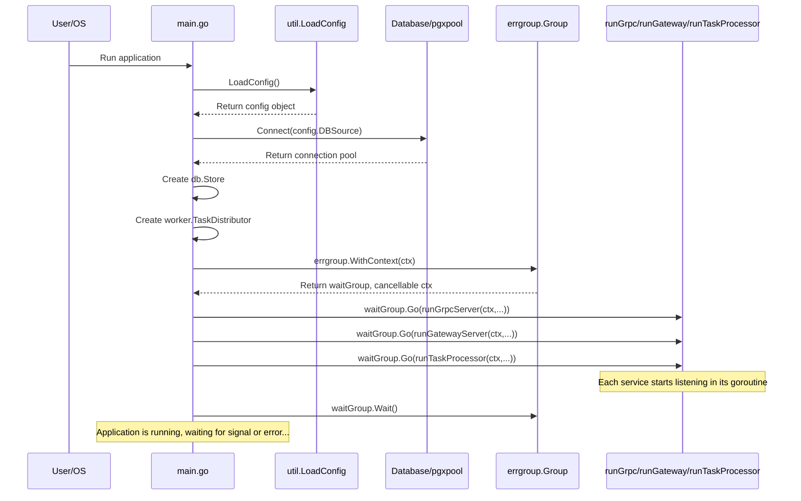

# Chapter 8: Application Orchestration & Entrypoint

Welcome to the final chapter of the SimpleBank backend tutorial! In [Chapter 7: Configuration Management](07_configuration_management_.md), we learned how to manage application settings like database connections and secret keys using configuration files and environment variables, making our application flexible and secure.

We've now built all the individual instruments of our SimpleBank orchestra:

- The [gRPC API Service](01_grpc_api_service_.md) (internal communication)
- The [Database Access Layer (sqlc)](02_database_access_layer__sqlc__.md) (talking to the vault)
- [Input Data Validation](03_input_data_validation_.md) (quality control)
- The [HTTP Gateway](04_http_gateway_.md) (customer service desk)
- [Authentication & Authorization (Token-Based)](05_authentication___authorization__token_based__.md) (security guards)
- The [Asynchronous Task Processing (Worker)](06_asynchronous_task_processing__worker_.md) (mailroom)
- [Configuration Management](07_configuration_management_.md) (instruction manual)

But who tells all these instruments when to start playing, how to coordinate, and when to stop? We need a **conductor**!

That's the role of our **Application Orchestration & Entrypoint**, primarily handled by the `main.go` file in our project.

## Motivation: Starting the Bank

Imagine you arrive at the bank building in the morning. It's not enough that the vault, the teller counters, and the mailroom exist. Someone needs to unlock the doors, turn on the lights, start the computer systems, connect to the network, and tell the staff (tellers, security, mailroom) to begin their work. Similarly, when the bank closes, someone needs to shut everything down in an orderly way.

Our `main.go` file is like that bank manager or conductor. It's the very first piece of code that runs when you start the SimpleBank application. Its job is to:

1.  Initialize all the necessary components (load settings, connect to the database, set up the task queue).
2.  Start the different services (the gRPC server, the HTTP gateway server, the background task worker) so they can begin listening for requests or tasks.
3.  Keep everything running smoothly together.
4.  Listen for signals to stop (like pressing Ctrl+C in the terminal) and manage a clean, **graceful shutdown** of all services.

Without this orchestration, our individual components wouldn't know how to connect or work together, and the application wouldn't function as a whole.

## Key Concepts

Let's break down the main responsibilities of our orchestrator (`main.go`).

### 1. The `main` Function: The Starting Point

Every executable Go program has a special function called `main` inside the `main` package. This is where the program's execution begins.

```go
// --- File: main.go ---
package main

// ... imports ...

// main is the entry point of our application
func main() {
    // 1. Load Configuration
    // 2. Connect to Database & Run Migrations
    // 3. Set up Task Distributor
    // 4. Run different services concurrently
    // 5. Wait for services to stop
}
```

This function sets the stage for everything else.

### 2. Initialization: Getting Ready

Before starting the servers, `main` prepares all the shared resources and dependencies:

- **Load Configuration:** It calls `util.LoadConfig` from [Chapter 7: Configuration Management](07_configuration_management_.md) to read settings from `app.env` or environment variables.
- **Connect Database:** It uses the loaded configuration (`config.DBSource`) to establish a connection pool to our PostgreSQL database using the `pgxpool` library.
- **Run Migrations:** It ensures the database schema is up-to-date by running database migrations (SQL scripts that define table structures). We use the `golang-migrate` library for this.
- **Create Store:** It initializes our [Database Access Layer (sqlc)](02_database_access_layer__sqlc__.md) (`db.Store`) using the database connection pool.
- **Create Task Distributor:** It sets up the connection to Redis and creates the `worker.TaskDistributor` (from [Chapter 6: Asynchronous Task Processing (Worker)](06_asynchronous_task_processing__worker_.md)) so that API handlers can queue background tasks.

```go
// --- File: main.go (Initialization Steps) ---
package main

import (
	// ... imports ...
	"github.com/jackc/pgx/v5/pgxpool"
	db "github.com/spaghetti-lover/simplebank/db/sqlc"
	"github.com/spaghetti-lover/simplebank/util"
	"github.com/spaghetti-lover/simplebank/worker"
	// ...
)

func main() {
	config, err := util.LoadConfig(".") // Load config first!
	if err != nil { log.Fatal().Err(err).Msg("cannot load config") }

	// ... (setup logging) ...

	ctx := context.Background() // Base context

	connPool, err := pgxpool.New(ctx, config.DBSource) // Connect DB
	if err != nil { log.Fatal().Err(err).Msg("cannot connect to db") }

	runDBMigration(config.MigrationURL, config.DBSource) // Apply DB schema

	store := db.NewStore(connPool) // Create DB access layer

	redisOpt := asynq.RedisClientOpt{ Addr: config.RedisAddress }
	taskDistributor := worker.NewRedisTaskDistributor(redisOpt) // Setup task queue client

	// ... Now ready to start services ...
}
```

These steps ensure all foundational pieces are ready before any server starts accepting requests.

### 3. Running Services Concurrently: Goroutines and `errgroup`

We need to run multiple things simultaneously:

- The gRPC server listening for internal API calls.
- The HTTP Gateway server listening for external HTTP requests.
- The Task Processor (Worker) listening for background jobs on Redis.

We can't just run them one after another; they need to run _at the same time_. Go uses **goroutines** for concurrency – lightweight threads managed by the Go runtime.

To manage these goroutines effectively (especially handling errors and waiting for them all), SimpleBank uses the `golang.org/x/sync/errgroup` package. It allows us to start multiple goroutines and wait for them to complete, capturing the first error that occurs in any of them.

```go
// --- File: main.go (Starting Services) ---
package main

import (
	// ... imports ...
	"golang.org/x/sync/errgroup"
	// ...
)

func main() {
	// ... (Initialization code from above) ...

	// Create an errgroup with a context that can be cancelled
	waitGroup, ctx := errgroup.WithContext(context.Background())

	// Start the Task Processor in its own goroutine
	runTaskProcessor(ctx, waitGroup, config, redisOpt, store)

	// Start the HTTP Gateway Server in its own goroutine
	runGatewayServer(ctx, waitGroup, config, store, taskDistributor)

	// Start the gRPC Server in its own goroutine
	runGrpcServer(ctx, waitGroup, config, store, taskDistributor)

	// Wait for all goroutines managed by waitGroup to finish
	// or for the first error to occur.
	err = waitGroup.Wait()
	if err != nil {
		log.Fatal().Err(err).Msg("error from wait group")
	}
}
```

- `errgroup.WithContext` creates a group and a context (`ctx`). If any function in the group returns an error, or if the context is cancelled, the group coordinates shutdown.
- `waitGroup.Go(func() error { ... })` starts a function (like `runTaskProcessor`) in a new goroutine managed by the group.
- `waitGroup.Wait()` blocks until all started goroutines have finished or an error occurs.

### 4. Graceful Shutdown: Stopping Politely

What happens if you press `Ctrl+C` to stop the application, or if the server needs to restart? If we just kill the process instantly, ongoing requests might be dropped, database transactions could be left incomplete, or background tasks might be interrupted halfway.

**Graceful shutdown** means telling each service to stop accepting _new_ work, finish any work it's _currently_ doing, and then shut down cleanly.

SimpleBank achieves this using Go's `os/signal` package and the context cancellation provided by `errgroup`:

```go
// --- File: main.go (Handling Signals) ---
package main

import (
	"context"
	"os"
	"os/signal"
	"syscall"
	// ...
)

// List of signals to listen for (Interrupt, Terminate)
var interruptSignals = []os.Signal{
	os.Interrupt,
	syscall.SIGTERM,
	syscall.SIGINT,
}

func main() {
	// ... (load config) ...

	// Create a context that gets cancelled when an interrupt signal is received
	ctx, stop := signal.NotifyContext(context.Background(), interruptSignals...)
	defer stop() // Ensure stop() is called eventually to release resources

	// ... (connect DB, setup store/distributor) ...

	// Pass the cancellable 'ctx' to the errgroup
	waitGroup, ctx := errgroup.WithContext(ctx)

	// Start services using the cancellable 'ctx' and 'waitGroup'
	runTaskProcessor(ctx, waitGroup, /* ... */)
	runGatewayServer(ctx, waitGroup, /* ... */)
	runGrpcServer(ctx, waitGroup, /* ... */)

	// ... (waitGroup.Wait()) ...
}
```

- `signal.NotifyContext` creates a context (`ctx`) that is automatically cancelled when one of the specified signals (like `SIGINT` from Ctrl+C) is received.
- This cancellable `ctx` is passed down to the `errgroup` and then into each `run...` function.
- Inside each `run...` function, another goroutine is launched specifically to listen for this context cancellation (`<-ctx.Done()`) and trigger the graceful shutdown procedure for that specific server (e.g., `httpServer.Shutdown()`, `grpcServer.GracefulStop()`).

## The Conductor: `main.go` in Action

The `main` function truly acts as the orchestrator. It doesn't contain the core logic of the gRPC API or the HTTP handlers (that's in `gapi/`), nor the database queries (that's in `db/`), nor the task processing logic (that's in `worker/`).

Instead, it focuses on:

1.  **Setup:** Reading [Configuration Management](07_configuration_management_.md), connecting to the [Database Access Layer (sqlc)](02_database_access_layer__sqlc__.md).
2.  **Instantiation:** Creating instances of the necessary components (`db.Store`, `worker.TaskDistributor`, `gapi.Server`, `worker.TaskProcessor`).
3.  **Execution:** Starting the servers and worker in concurrent goroutines using `errgroup`.
4.  **Lifecycle Management:** Handling startup order and coordinating graceful shutdown via signals and context cancellation.

The actual work of starting each server is delegated to helper functions like `runGrpcServer`, `runGatewayServer`, and `runTaskProcessor`.

## Under the Hood: Starting and Stopping

Let's visualize the startup process orchestrated by `main`:



Now, let's look briefly inside one of the helper functions, like `runGrpcServer`:

```go
// --- File: main.go (Simplified runGrpcServer) ---

func runGrpcServer(
	ctx context.Context, // The cancellable context
	waitGroup *errgroup.Group,
	config util.Config,
	store db.Store,
	taskDistributor worker.TaskDistributor,
) {
	// Create the actual gRPC server logic implementation
	server, err := gapi.NewServer(config, store, taskDistributor)
	if err != nil { log.Fatal().Err(err).Msg("cannot create gapi server") }

	// Create the base gRPC server from Google's library
	grpcServer := grpc.NewServer(/* ... interceptors ... */)
	// Register our implementation with the base server
	pb.RegisterSimpleBankServer(grpcServer, server)
	reflection.Register(grpcServer) // Allow gRPC reflection

	listener, err := net.Listen("tcp", config.GRPCServerAddress)
	// ... error handling ...

	// Start the server in a new goroutine managed by errgroup
	waitGroup.Go(func() error {
		log.Info().Msgf("start gRPC server at %s", listener.Addr().String())
		err = grpcServer.Serve(listener) // Blocks until server stops
		// ... error handling (ignore ErrServerStopped on graceful shutdown) ...
		return err
	})

	// Start *another* goroutine just to handle graceful shutdown
	waitGroup.Go(func() error {
		<-ctx.Done() // Wait until the context is cancelled (e.g., Ctrl+C)
		log.Info().Msg("graceful shutdown gRPC server")
		grpcServer.GracefulStop() // Tell gRPC server to stop gracefully
		log.Info().Msg("gRPC server is stopped")
		return nil
	})
}
```

- It creates the `gapi.Server` instance, which holds the actual API logic.
- It creates the underlying `grpc.Server` and registers our service.
- It starts listening for connections.
- Crucially, it uses `waitGroup.Go` twice:
  - Once to run the main server loop (`grpcServer.Serve`).
  - Once to listen for context cancellation (`<-ctx.Done()`) and trigger `grpcServer.GracefulStop()`.

The `runGatewayServer` and `runTaskProcessor` functions follow a similar pattern: start the main service loop in one goroutine and handle graceful shutdown based on context cancellation in another. This ensures that when a shutdown signal is received, the context gets cancelled, triggering the graceful shutdown logic for _all_ running services concurrently.

## Conclusion

We've reached the end of our SimpleBank backend journey! This chapter showed how the `main.go` file acts as the crucial **Application Orchestrator and Entrypoint**:

- It's the **starting point** (`main` function) of the application.
- It **initializes** all necessary components based on [Configuration Management](07_configuration_management_.md) and connects to resources like the [Database Access Layer (sqlc)](02_database_access_layer__sqlc__.md).
- It **starts** the [gRPC API Service](01_grpc_api_service_.md), [HTTP Gateway](04_http_gateway_.md), and [Asynchronous Task Processing (Worker)](06_asynchronous_task_processing__worker_.md) concurrently using goroutines managed by `errgroup`.
- It manages the application's **lifecycle**, ensuring a clean **graceful shutdown** when stop signals are received.

By bringing all the individual components we built in previous chapters together and managing their execution, `main.go` turns our collection of parts into a fully functional SimpleBank application.

Congratulations on completing the SimpleBank backend tutorial! You've explored key concepts in backend development, from API design and database interaction to security, background tasks, and application structure. We hope this journey has provided a solid foundation for your future projects.

---
