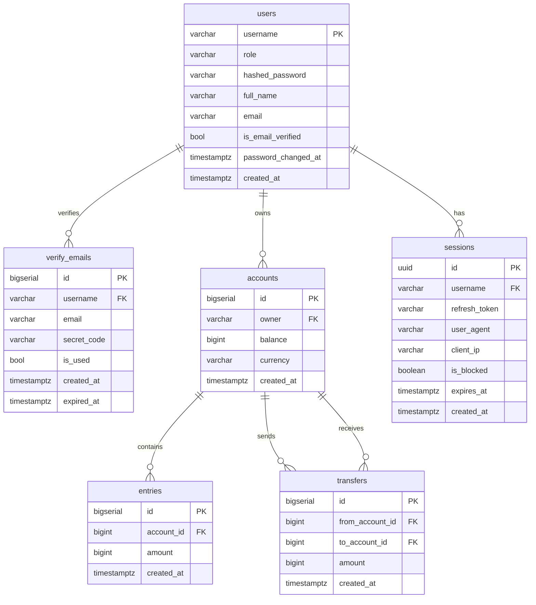

```mermaid
erDiagram
    users {
        varchar username PK
        varchar role
        varchar hashed_password
        varchar full_name
        varchar email
        bool is_email_verified
        timestamptz password_changed_at
        timestamptz created_at
    }

    verify_emails {
        bigserial id PK
        varchar username FK
        varchar email
        varchar secret_code
        bool is_used
        timestamptz created_at
        timestamptz expired_at
    }

    accounts {
        bigserial id PK
        varchar owner FK
        bigint balance
        varchar currency
        timestamptz created_at
    }

    entries {
        bigserial id PK
        bigint account_id FK
        bigint amount
        timestamptz created_at
    }

    transfers {
        bigserial id PK
        bigint from_account_id FK
        bigint to_account_id FK
        bigint amount
        timestamptz created_at
    }

    sessions {
        uuid id PK
        varchar username FK
        varchar refresh_token
        varchar user_agent
        varchar client_ip
        boolean is_blocked
        timestamptz expires_at
        timestamptz created_at
    }

    users ||--o{ verify_emails : "verifies"
    users ||--o{ accounts : "owns"
    users ||--o{ sessions : "has"
    accounts ||--o{ entries : "contains"
    accounts ||--o{ transfers : "sends"
    accounts ||--o{ transfers : "receives"
```
